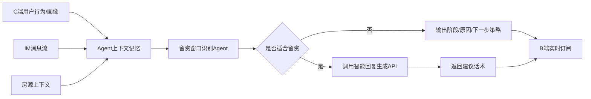

# AI 留资 Agent 工作流简版方案

## 1. 目标

在用户与经纪人 IM 沟通过程中，Agent 持续结合用户画像、浏览轨迹、房源上下文和聊天内容，实时识别用户是否进入适合留手机号的窗口期。

当进入窗口期时，Agent 不直接生成最终回复，而是调用公司职能部门已有的“智能回复生成 API”，生成更符合平台规范和业务风格的经纪人建议话术。

核心目标：

1. 判断什么时候适合引导用户留手机号。
2. 给出判断原因和经纪人沟通策略。
3. 调用智能回复 API 生成建议回复。
4. 保留会话上下文记忆，支持多轮持续判断。
5. 将最新判断结果实时推送给 B 端经纪人。

## 2. 总体架构



## 3. 模块分工

### 3.1 Agent 上下文记忆

负责按 `conversation_id` 累计和维护当前会话的上下文。

记忆内容包括：

| 类型 | 内容 | 更新方式 |
| --- | --- | --- |
| 用户画像 | 城市、预算、目标区域、户型、入住时间、偏好标签 | 增量合并 |
| 浏览轨迹 | 浏览房源、收藏、VR、地图、户型图、停留时长、重复访问 | 追加 |
| 房源上下文 | 当前咨询房源、小区、价格、户型、区域、是否可看 | 增量合并 |
| 对话历史 | 用户和经纪人的 IM 消息 | 追加 |
| 分析状态 | 当前阶段、留资分、风险标记、最近一次建议 | 覆盖更新 |

建议保留策略：

1. 画像和房源上下文保留最新合并结果。
2. 行为轨迹保留最近 100 条。
3. 聊天消息保留最近 50 条。
4. 长会话可定期生成会话摘要，减少模型输入长度。

## 4. 工作流设计

### 4.1 上下文累计

C 端、B 端或 IM 服务在产生新数据时调用 Agent 更新接口。

```text
POST /agent/conversation/update
```

输入示例：

```json
{
  "conversation_id": "c_001",
  "user_profile": {
    "budget_range": [5000, 6500],
    "target_area": "朝阳",
    "room_type_preference": "一居室"
  },
  "property_context": {
    "community": "望京花园",
    "district": "朝阳",
    "price": 5800,
    "layout": "一居室"
  },
  "behaviors": [
    {"type": "view_vr"},
    {"type": "favorite"}
  ],
  "messages": [
    {"sender": "user", "content": "周末能看吗？"}
  ]
}
```

处理逻辑：

1. 根据 `conversation_id` 获取会话记忆。
2. 合并用户画像和房源上下文。
3. 追加行为轨迹和聊天消息。
4. 触发留资窗口识别。
5. 保存最新分析结果。
6. 推送给 B 端订阅方。

### 4.2 留资窗口识别

Agent 使用“大模型 + 规则兜底”的方式判断当前是否适合留资。

大模型负责：

1. 理解用户真实意图。
2. 判断当前沟通阶段。
3. 识别看房、比较、顾虑、拒绝、流失等信号。
4. 输出判断原因和沟通策略。

规则负责：

1. 行为分和匹配分计算。
2. 拒绝留资后的冷却。
3. 用户顾虑未解决时拦截留资提示。
4. 提示频控。
5. 防止旧请求覆盖新分析结果。

输出示例：

```json
{
  "conversation_id": "c_001",
  "stage": "visit_intent",
  "lead_score": 86,
  "confidence": 0.84,
  "should_prompt_agent": true,
  "prompt_level": "strong",
  "reason": "用户询问周末能否看房，行动意图明确。",
  "agent_strategy": "以确认看房时间为理由自然引导留手机号。",
  "risk_flags": []
}
```

### 4.3 调用智能回复生成 API

当满足以下条件时，Agent 调用公司职能部门的智能回复生成 API：

1. `should_prompt_agent = true`
2. `prompt_level = strong` 或 `soft`
3. 当前不存在强风险标记，例如用户刚拒绝留电话、费用顾虑未处理
4. 留资理由自然成立，例如约看、确认房源状态、整理推荐、同步看房时间

调用智能回复 API 时，Agent 不只传一句用户消息，而是传结构化上下文和策略。

建议请求结构：

```json
{
  "conversation_id": "c_001",
  "scene": "lead_capture",
  "user_profile": {
    "budget_range": [5000, 6500],
    "target_area": "朝阳",
    "room_type_preference": "一居室"
  },
  "property_context": {
    "community": "望京花园",
    "price": 5800,
    "layout": "一居室"
  },
  "conversation_history": [
    {"sender": "user", "content": "这套还在吗？"},
    {"sender": "agent", "content": "这套目前还在，价格是5800。"},
    {"sender": "user", "content": "周末能看吗？"}
  ],
  "agent_decision": {
    "stage": "visit_intent",
    "lead_score": 86,
    "reason": "用户询问周末能否看房，行动意图明确。",
    "strategy": "先回应看房诉求，再以确认看房安排为理由引导留手机号。"
  },
  "reply_requirements": {
    "tone": "自然、专业、低压",
    "must_include": ["回应看房", "说明留电话用途"],
    "must_not_include": ["不留电话不能看房", "强迫用户留资", "过度承诺"]
  }
}
```

智能回复 API 返回：

```json
{
  "reply": "这套周末可以帮您约看，我先确认下房东和钥匙时间。方便留个电话吗？确认好后我第一时间同步您。",
  "style": "natural",
  "risk_level": "low"
}
```

Agent 拿到回复后，需要再次做简单风控：

1. 是否包含强迫留资表达。
2. 是否承诺不可控事项。
3. 是否绕开平台规则。
4. 是否与当前用户问题不匹配。

通过后再推送给 B 端。

## 5. B 端实时订阅

B 端进入聊天页后订阅当前会话状态。

```text
GET /agent/window/stream?conversation_id=c_001
```

推送示例：

```json
{
  "conversation_id": "c_001",
  "stage": "visit_intent",
  "lead_score": 86,
  "confidence": 0.84,
  "should_prompt_agent": true,
  "prompt_level": "strong",
  "reason": "用户询问周末能否看房，行动意图明确。",
  "agent_strategy": "以确认看房时间为理由自然引导留手机号。",
  "suggested_reply": "这套周末可以帮您约看，我先确认下房东和钥匙时间。方便留个电话吗？确认好后我第一时间同步您。"
}
```

B 端展示建议：

1. `prompt_level = none`：不展示。
2. `prompt_level = passive`：侧边展示当前阶段和留资分。
3. `prompt_level = soft`：输入框上方展示建议。
4. `prompt_level = strong`：展示“现在适合引导留电话”提示卡。
5. `prompt_level = warning`：提示经纪人先处理用户顾虑，不建议要电话。

## 6. Agent 上下文记忆设计

### 6.1 短期记忆

短期记忆用于当前会话实时判断。

包括：

1. 最近聊天消息。
2. 最近浏览行为。
3. 当前房源上下文。
4. 当前需求槽位。
5. 最近一次窗口期判断。

### 6.2 需求槽位

Agent 可持续维护结构化需求槽位：

```json
{
  "budget": "5000-6500",
  "area": "朝阳",
  "layout": "一居室",
  "move_in_time": "本月底",
  "visit_time": "周末",
  "concerns": ["费用", "真实性"],
  "intent_level": "high"
}
```

每次对话更新后，Agent 更新槽位。

### 6.3 会话摘要

当会话较长时，Agent 生成摘要，减少模型输入。

摘要示例：

```text
用户关注朝阳一居室，预算5000-6500，倾向近地铁，已询问周末能否看房。经纪人已确认房源在架并介绍价格。当前适合以确认看房时间为理由引导留手机号。
```

模型输入建议由三部分组成：

1. 会话摘要。
2. 结构化画像和行为。
3. 最近 10-20 条原始消息。

## 7. 并发与版本控制

同一会话可能连续上传多条消息或行为，因此需要版本控制。

推荐机制：

1. 每次 update 时 `version + 1`。
2. 分析开始时记录当前 version。
3. 分析结束后，如果发现 version 已变化，说明有新数据进入，旧结果不覆盖最新状态。
4. 只推送最新 version 对应的分析结果。

这样可以避免旧请求后完成，覆盖新请求结果。

## 8. 风控规则

以下场景不应触发留资话术：

1. 用户刚明确拒绝留手机号。
2. 用户正在询问中介费、押金、真实性，且经纪人尚未回答。
3. 用户表达“再看看”“不用了”“太贵了”等流失信号。
4. 经纪人已经连续索要手机号。
5. 话术中包含强迫、威胁或过度承诺。

建议输出 `risk_flags`：

```json
["phone_refusal", "fee_concern", "churn_risk"]
```

## 9. 推荐落地路径

### 第一期

1. 上下文累计。
2. 大模型识别阶段和窗口期。
3. 规则兜底和风险拦截。
4. 窗口期到达后调用智能回复 API。
5. B 端实时订阅并展示建议。

### 第二期

1. 增加需求槽位记忆。
2. 增加会话摘要。
3. 增加提示频控。
4. 增加经纪人反馈闭环。

### 第三期

1. 基于历史数据训练留资窗口预测模型。
2. 按城市、业务线、经纪人风格做个性化策略。
3. 优化智能回复 API 的场景化输入模板。

## 10. 一句话总结

新版工作流中，Agent 负责“看懂上下文、判断窗口期、维护记忆和控制风险”；公司职能部门的智能回复 API 负责“生成最终经纪人回复文案”；B 端通过实时订阅获得最新判断和建议，从而在合适时机自然引导用户留资。
