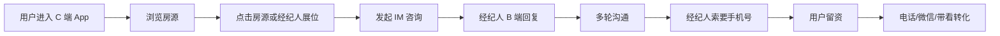
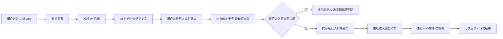
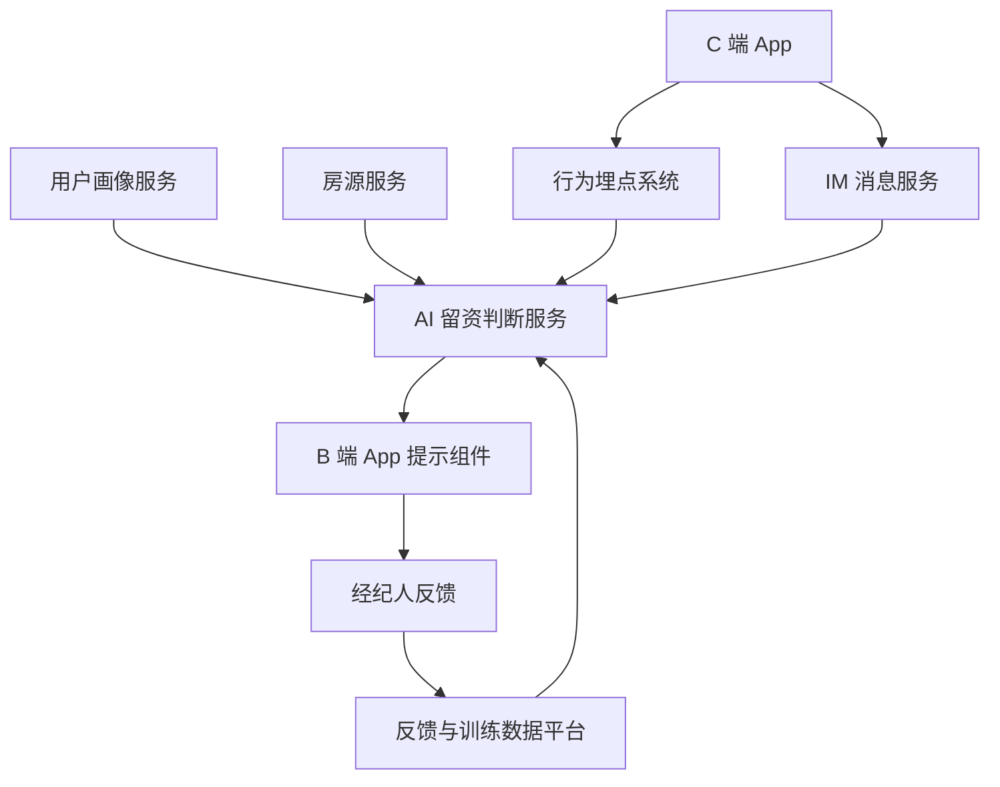
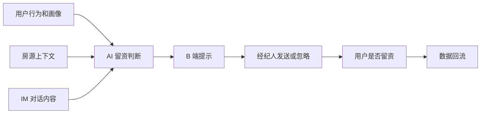

# AI 留资窗口期判断助手产品方案

## 1. 背景

我爱我家找房租房 App 当前的核心转化链路为：

用户从 C 端 App 进入，浏览房源或经纪人展位，发起 IM 咨询；经纪人在 B 端 App 回复，通过多轮沟通了解用户需求，并引导用户留下手机号，完成留资。留资后，经纪人可进一步通过电话、微信、带看等方式推进转化。

当前链路中，手机号留资高度依赖经纪人的个人经验。经纪人需要在聊天过程中判断用户是否已经具备较强意向，以及何时开口索要手机号最自然。如果索要过早，容易造成用户反感或沉默；如果索要过晚，可能错过最佳转化时机。

因此，希望引入 AI 工具，结合 C 端用户画像、浏览轨迹、房源上下文和实时 IM 对话内容，持续判断用户是否进入最佳留资窗口期，并在合适时机给经纪人提供提示和建议回复文案。

## 2. 产品定位

AI 留资窗口期判断助手，是面向房产 IM 场景的实时决策与话术辅助工具。

它不是自动替经纪人向用户索要手机号，而是帮助经纪人在正确时机、用更自然的方式引导用户留资。

核心定位：

> 基于用户画像、浏览行为、房源上下文和实时对话，判断用户是否进入留资窗口期，并为经纪人提供低打扰、可执行、合规的沟通建议。

## 3. 目标

### 3.1 业务目标

1. 提升 C 端 IM 咨询到手机号留资的转化率。
2. 缩短用户从发起咨询到完成留资的平均时长。
3. 提升留资后的带看转化和成交转化。
4. 降低因经纪人过早或反复索要手机号造成的用户流失。

### 3.2 产品目标

1. 实时识别用户所处沟通阶段。
2. 实时计算用户当前留资意向分。
3. 在用户进入留资窗口期时提示经纪人。
4. 给出当前判断原因和沟通策略。
5. 生成可直接发送或稍作修改后发送的建议话术。
6. 在不适合留资时，提示经纪人优先回答问题、澄清需求或处理顾虑。

### 3.3 用户体验目标

1. C 端用户不会一进入 IM 就被生硬索要手机号。
2. 经纪人的沟通效率提高，但不会被高频提示打扰。
3. 平台能够沉淀可解释、可优化的转化策略。

## 4. 适用范围

### 4.1 一期范围

一期建议聚焦租房 IM 场景，尤其是用户主动咨询房源后的会话。

一期支持：

1. 用户画像和浏览轨迹初始化。
2. IM 对话实时分析。
3. 用户阶段判断。
4. 留资分计算。
5. 强窗口期提示。
6. 经纪人建议话术生成。
7. 经纪人反馈和转化结果回流。

### 4.2 暂不覆盖

1. AI 自动发送消息。
2. 跨平台私域沟通策略。
3. 买卖房复杂交易链路的深度决策。
4. 自动承诺房源可看、价格可谈、业主接受条件等不可控事项。

## 5. 核心链路

### 5.1 当前链路



### 5.2 AI 加入后的链路



## 6. 用户角色

### 6.1 C 端用户

典型状态包括：

1. 随便看看。
2. 有区域、预算、户型等初步偏好。
3. 对某套房源感兴趣。
4. 正在比较多套房源。
5. 关注费用、真实性、通勤、入住时间等问题。
6. 有明确看房意向。
7. 愿意留资，但需要合理理由。

### 6.2 B 端经纪人

核心诉求：

1. 快速理解客户真实需求。
2. 判断什么时候适合要电话。
3. 提升留资成功率。
4. 获得可直接使用的话术。
5. 避免因沟通不当造成用户流失。

### 6.3 平台

核心诉求：

1. 提升 IM 留资转化。
2. 规范经纪人话术。
3. 降低用户投诉和反感。
4. 沉淀用户意向和转化策略数据。

## 7. 输入数据设计

### 7.1 用户基础信息

| 字段 | 说明 |
| --- | --- |
| user_id | 用户 ID |
| city | 当前城市 |
| location | 当前定位或常驻区域 |
| is_new_user | 是否新用户 |
| historical_consult_count | 历史咨询次数 |
| historical_lead_status | 历史留资情况 |
| historical_visit_status | 历史带看情况 |
| entry_source | IM 入口来源 |

### 7.2 用户画像

| 字段 | 说明 |
| --- | --- |
| intent_type | 租房、买房等 |
| budget_range | 预算区间 |
| target_area | 目标区域 |
| room_type_preference | 户型偏好 |
| size_preference | 面积偏好 |
| commute_preference | 通勤偏好 |
| move_in_time | 入住时间 |
| tags | 地铁、整租、合租、宠物、学区等偏好标签 |

### 7.3 浏览行为

| 行为 | 说明 |
| --- | --- |
| property_view | 浏览房源 |
| view_duration | 停留时长 |
| favorite | 收藏房源 |
| compare | 对比房源 |
| share | 分享房源 |
| view_vr | 查看 VR |
| view_floor_plan | 查看户型图 |
| view_map | 查看地图 |
| click_agent_booth | 点击经纪人展位 |
| repeat_visit | 重复访问同一房源 |

### 7.4 房源上下文

| 字段 | 说明 |
| --- | --- |
| property_id | 房源 ID |
| city | 城市 |
| district | 区域 |
| community | 小区 |
| price | 租金或售价 |
| layout | 户型 |
| area | 面积 |
| floor | 楼层 |
| orientation | 朝向 |
| subway_distance | 地铁距离 |
| availability | 是否可看 |
| listing_status | 在架状态 |
| similar_properties | 相似房源 |

### 7.5 IM 对话

| 字段 | 说明 |
| --- | --- |
| conversation_id | 会话 ID |
| sender | user 或 agent |
| content | 消息内容 |
| message_type | 文本、房源卡片、图片、电话卡片等 |
| timestamp | 发送时间 |
| referenced_property_id | 关联房源 ID |

## 8. 用户阶段模型

### 8.1 阶段枚举

| 阶段 | 说明 | 是否适合留资 |
| --- | --- | --- |
| cold_browse | 低意向浏览，只是泛问 | 不适合 |
| need_clarification | 需求澄清，用户有初步意向但信息不足 | 不适合 |
| property_interest | 对单套房源感兴趣 | 视情况 |
| comparison | 多房源比较 | 弱窗口 |
| objection_handling | 正在处理顾虑 | 不适合 |
| visit_intent | 有看房行动意愿 | 强窗口 |
| lead_capture_window | 留资窗口期 | 强窗口 |
| churn_risk | 流失风险 | 不适合 |

### 8.2 阶段说明

#### cold_browse 低意向浏览

典型表达：

1. “这个多少钱？”
2. “还在吗？”
3. “看看。”
4. “有图片吗？”

建议策略：

先回答问题，提供有效信息，不建议立即索要手机号。

#### need_clarification 需求澄清

典型表达：

1. “附近还有吗？”
2. “有没有便宜点的？”
3. “我想找一居。”
4. “地铁近一点的有吗？”

建议策略：

引导用户补充预算、区域、入住时间、户型等关键需求。

#### property_interest 单房源兴趣

典型表达：

1. “这套还能看吗？”
2. “价格真实吗？”
3. “几楼？”
4. “离地铁多远？”

建议策略：

先回答房源关键问题。如果用户进一步询问看房或房源状态，可进入留资窗口。

#### comparison 多房源比较

典型表达：

1. “这套和刚才那套哪个好？”
2. “还有类似的吗？”
3. “附近有没有两居？”

建议策略：

体现经纪人筛选价值，可用“整理几套匹配房源”作为弱留资理由。

#### objection_handling 顾虑处理

典型表达：

1. “中介费多少？”
2. “会不会是假的？”
3. “能不能便宜？”
4. “押一付几？”

建议策略：

先处理顾虑，不建议直接索要手机号。

#### visit_intent 看房意向

典型表达：

1. “什么时候能看？”
2. “今天能看吗？”
3. “周末方便吗？”
4. “怎么约？”

建议策略：

这是强留资窗口。建议以确认钥匙、房东时间、看房安排为理由自然引导留手机号。

#### lead_capture_window 留资窗口期

进入条件：

1. 用户需求相对明确。
2. 用户存在行动意图或后续跟进需求。
3. 经纪人已回答用户当前关键问题。
4. 留资理由自然成立。
5. 最近没有拒绝或反感信号。

建议策略：

提示经纪人引导留资，并给出具体话术。

#### churn_risk 流失风险

典型表达：

1. “算了。”
2. “太贵了。”
3. “再看看。”
4. 长时间不回复。

建议策略：

低压挽回，不强求留资。

## 9. 留资评分模型

### 9.1 评分定义

系统输出 0-100 的 lead_score，用于表示当前会话进入留资窗口期的可能性。

评分区间：

| 分数 | 含义 | 策略 |
| --- | --- | --- |
| 0-39 | 低意向 | 不提示留资 |
| 40-59 | 可培养 | 提示继续澄清需求 |
| 60-74 | 弱窗口 | 可软性试探 |
| 75-89 | 强窗口 | 建议提示经纪人 |
| 90-100 | 立即窗口 | 强提示经纪人 |

### 9.2 行为分

| 信号 | 分值 |
| --- | --- |
| 发起 IM | +15 |
| 点击经纪人展位 | +10 |
| 收藏房源 | +10 |
| 查看 VR/户型图/地图 | +8 |
| 浏览同小区或同商圈多套房源 | +8 |
| 浏览当前房源超过 30 秒 | +5 |
| 多次回访同一房源 | +12 |

### 9.3 画像匹配分

| 信号 | 分值 |
| --- | --- |
| 房源价格匹配预算 | +10 |
| 区域匹配偏好 | +10 |
| 户型匹配 | +8 |
| 通勤或地铁匹配 | +6 |
| 入住时间较近 | +10 |

### 9.4 对话意图分

| 信号 | 分值 |
| --- | --- |
| 询问房源是否还在 | +5 |
| 询问真实价格或费用 | +8 |
| 给出预算 | +10 |
| 给出区域 | +8 |
| 给出入住时间 | +12 |
| 要求推荐类似房源 | +12 |
| 询问能否看房 | +20 |
| 明确表达想看房 | +25 |

### 9.5 风险扣分

| 信号 | 分值 |
| --- | --- |
| 用户质疑真实性未被回应 | -20 |
| 用户明确拒绝留电话 | -30 |
| 经纪人连续追问手机号 | -25 |
| 用户表示“再看看” | -15 |
| 用户长时间未回复 | -10 |
| 用户问题未被回答就索要手机号 | -20 |

## 10. 窗口期判断规则

不建议只通过分数判断是否提示留资。强窗口需要同时满足必要条件。

### 10.1 强窗口必要条件

1. 用户存在明确行动意图，或提出需要经纪人后续跟进的事项。
2. 用户至少表达一个核心需求，最好两个以上。
3. 经纪人已经回应用户当前最关心的问题。
4. 留资理由自然成立，例如约看、确认房源状态、整理推荐、同步价格等。
5. 最近 1-2 轮没有明显拒绝或反感信号。

### 10.2 适合提示的例子

用户：

> 这套周六能看吗？

经纪人：

> 可以，我帮您确认下房东和钥匙。

AI 判断：

用户已出现明确看房意向，且留资理由自然成立。适合提示经纪人引导留手机号。

### 10.3 不适合提示的例子

用户：

> 中介费多少？

经纪人尚未回答费用问题。

AI 判断：

用户正在关注费用顾虑，直接索要手机号可能增加防备。建议先解释费用规则。

## 11. AI 输出设计

### 11.1 输出字段

| 字段 | 类型 | 说明 |
| --- | --- | --- |
| conversation_id | string | 会话 ID |
| stage | string | 当前用户阶段 |
| lead_score | number | 留资分 |
| confidence | number | 置信度 |
| should_prompt_agent | boolean | 是否提示经纪人 |
| prompt_level | string | 提示等级 |
| reason | string | 判断原因 |
| agent_strategy | string | 经纪人沟通策略 |
| suggested_reply | string | 建议回复文案 |
| next_best_question | string | 下一步建议问题 |
| missing_info | array | 缺失信息 |
| risk_flags | array | 风险标记 |
| do_not_say | array | 不建议表达 |

### 11.2 适合留资时输出示例

```json
{
  "conversation_id": "c_123",
  "stage": "visit_intent",
  "lead_score": 84,
  "confidence": 0.88,
  "should_prompt_agent": true,
  "prompt_level": "strong",
  "reason": "用户询问周末能否看房，且已明确预算和区域，当前留资理由自然成立。",
  "agent_strategy": "先确认可约看，再以同步看房时间为理由引导留手机号。",
  "suggested_reply": "这套周末可以约看，我先帮您确认房东和具体时间。方便留个电话吗？确认好后我第一时间同步您。",
  "next_best_question": null,
  "missing_info": [],
  "risk_flags": [],
  "do_not_say": [
    "不留电话不能看房",
    "反复催促用户留手机号"
  ]
}
```

### 11.3 不适合留资时输出示例

```json
{
  "conversation_id": "c_123",
  "stage": "objection_handling",
  "lead_score": 48,
  "confidence": 0.79,
  "should_prompt_agent": false,
  "prompt_level": "passive",
  "reason": "用户正在询问中介费，存在费用顾虑，直接索要手机号可能增加防备。",
  "agent_strategy": "先清楚解释费用规则，并补充房源真实性和可看情况。",
  "suggested_reply": "这套的费用我先跟您说清楚，避免您白跑。租金是每月5200，付款方式目前是押一付三，中介费按平台规则收取。我也可以帮您对比几套费用更低的。",
  "next_best_question": "您这边更希望控制总月租，还是更在意付款方式灵活一些？",
  "missing_info": [
    "付款方式偏好",
    "预算上限"
  ],
  "risk_flags": [
    "fee_concern"
  ],
  "do_not_say": [
    "先留电话再说",
    "这个必须电话沟通"
  ]
}
```

## 12. 经纪人端交互设计

### 12.1 普通状态

在输入框上方或侧边展示轻量状态：

1. 当前阶段：需求澄清。
2. 留资评分：52。
3. 建议：先问预算和入住时间。

该状态不弹窗，不打断经纪人。

### 12.2 强窗口状态

当 should_prompt_agent = true 且 prompt_level = strong 时，展示提示卡。

提示卡内容：

标题：

> 现在适合引导留电话

原因：

> 用户已询问周末看房，且预算和区域较明确。

建议话术：

> 这套周末可以约看，我先帮您确认房东和具体时间。方便留个电话吗？确认好后我第一时间同步您。

操作按钮：

1. 一键填入。
2. 换一种说法。
3. 暂不提示。
4. 标记不准确。

### 12.3 风险提醒状态

当经纪人准备索要手机号，但系统判断用户不适合留资时，给出风险提醒。

示例：

> 用户还在关注费用问题，建议先解释清楚后再引导留资。

### 12.4 话术风格

建议支持以下风格：

1. 专业直接。
2. 亲和自然。
3. 高效简短。
4. 稳健低压。

## 13. 提示策略

为避免对经纪人形成打扰，需要设计提示频控。

### 13.1 提示等级

| 等级 | 说明 |
| --- | --- |
| none | 不提示 |
| passive | 侧边状态展示 |
| soft | 输入框上方建议 |
| strong | 强窗口提示卡 |
| warning | 风险提醒 |

### 13.2 频控规则

1. 同一会话强提示最多 2-3 次。
2. 用户拒绝留资后，至少 5 分钟或 3 轮用户消息内不再提示。
3. 经纪人忽略提示后，降低后续提示频率。
4. 只有 score 跨过阈值或阶段发生变化才主动提示。
5. 经纪人手动点击“AI 建议”时，可随时生成。

## 14. 推荐话术原则

### 14.1 基本原则

1. 先回应用户问题，再提出留资。
2. 留资必须有合理用途。
3. 不制造压迫感。
4. 不夸大承诺。
5. 不说“不留电话就不能看”。
6. 尽量结合房源、看房、时间、筛选、同步结果。
7. 避免模板感。

### 14.2 典型话术

看房场景：

> 这套目前可以约看，我先帮您确认下钥匙和房东时间。方便留个电话吗？确认好后我第一时间同步您。

多房源推荐场景：

> 您刚才提到预算和通勤，我可以帮您把附近几套更匹配的整理一下。方便留个电话吗？筛好后我直接发您，省得您一套套翻。

房源状态确认场景：

> 这套我帮您再确认下是否刚被预定，以及还能不能看。方便留个电话吗？有结果我第一时间告诉您。

用户急迫场景：

> 您如果这两天就想看，我可以优先帮您排一下时间。方便留个电话吗？我确认好路线和钥匙后马上同步您。

用户有顾虑场景：

> 我先把费用和看房情况给您确认清楚，您觉得合适的话，我们再约时间看，不着急。

## 15. 系统架构



### 15.1 AI 服务模块

| 模块 | 职责 |
| --- | --- |
| Context Builder | 拼接用户画像、房源、行为、对话上下文 |
| Conversation State Manager | 维护阶段、需求槽位、风险标记 |
| Signal Extractor | 提取意图、实体、情绪和行动信号 |
| Lead Scoring Engine | 计算留资分 |
| Decision Engine | 判断是否提示、提示等级和提示时机 |
| Response Generator | 生成经纪人策略和话术 |
| Guardrail | 过滤不合适、违规、过度承诺的话术 |
| Feedback Logger | 记录采纳、修改、留资和转化结果 |

## 16. 接口设计

### 16.1 会话初始化接口

`POST /ai/lead-assistant/session/init`

请求示例：

```json
{
  "conversation_id": "c_123",
  "user_id": "u_123",
  "agent_id": "a_456",
  "city": "北京",
  "entry_source": "property_detail",
  "current_property": {},
  "user_profile": {},
  "recent_behaviors": []
}
```

返回示例：

```json
{
  "stage": "need_clarification",
  "lead_score": 42,
  "summary": "用户近期集中浏览朝阳区一居室，预算疑似5000-6000。",
  "agent_opening_suggestion": "您好，这套目前还在，您是想了解看房时间，还是想先确认价格和费用？"
}
```

### 16.2 实时分析接口

`POST /ai/lead-assistant/analyze`

请求示例：

```json
{
  "conversation_id": "c_123",
  "new_events": [
    {
      "type": "message",
      "sender": "user",
      "content": "这套周末能看吗？",
      "timestamp": 1780992000000
    }
  ],
  "context": {
    "user_profile": {},
    "current_property": {},
    "recent_behaviors": []
  }
}
```

返回示例：

```json
{
  "stage": "visit_intent",
  "lead_score": 84,
  "confidence": 0.88,
  "should_prompt_agent": true,
  "prompt_level": "strong",
  "reason": "用户询问周末看房，行动意图明确。",
  "suggested_reply": "这套周末可以约看，我先帮您确认房东和具体时间。方便留个电话吗？确认好后我第一时间同步您。",
  "agent_strategy": "以确认看房时间为理由自然引导留电话。",
  "risk_flags": [],
  "missing_info": []
}
```

### 16.3 反馈接口

`POST /ai/lead-assistant/feedback`

请求示例：

```json
{
  "conversation_id": "c_123",
  "suggestion_id": "s_789",
  "agent_action": "accepted",
  "final_sent_text": "这套周末可以看，我先帮您确认下时间，方便留个电话吗？",
  "user_left_phone": true,
  "phone_left_time": 1780992100000
}
```

## 17. Prompt 设计

### 17.1 系统 Prompt 示例

```text
你是房产 IM 场景中的经纪人辅助助手。
你的任务是判断当前是否适合引导用户留下手机号，并给经纪人生成自然、合规、低打扰的回复建议。

你必须遵守：
1. 先判断用户当前阶段。
2. 不要在用户问题未被回答前建议索要手机号。
3. 不要在用户表达拒绝或反感后继续催促。
4. 留资必须有合理理由，如约看、确认房源状态、整理推荐、同步价格。
5. 回复文案要像真人经纪人自然表达，不能模板化。
6. 不得承诺无法保证的事项。
7. 输出必须是 JSON。
```

### 17.2 输入结构

```json
{
  "user_profile": {},
  "behavior_context": {},
  "property_context": {},
  "conversation_history": [],
  "latest_event": {}
}
```

### 17.3 输出结构

```json
{
  "stage": "",
  "lead_score": 0,
  "confidence": 0,
  "should_prompt_agent": false,
  "prompt_level": "",
  "reason": "",
  "agent_strategy": "",
  "suggested_reply": "",
  "missing_info": [],
  "risk_flags": [],
  "do_not_say": []
}
```

## 18. 埋点设计

### 18.1 核心埋点

| 事件 | 说明 |
| --- | --- |
| ai_suggestion_exposed | AI 提示曝光 |
| ai_suggestion_clicked | 经纪人点击提示 |
| ai_reply_inserted | 一键填入话术 |
| ai_reply_modified | 经纪人修改话术 |
| ai_reply_sent | 经纪人发送 AI 话术 |
| ai_suggestion_ignored | 经纪人忽略提示 |
| ai_suggestion_disliked | 经纪人标记不准确 |
| user_phone_left | 用户完成留资 |
| user_rejected_phone_request | 用户拒绝留资 |
| user_silent_after_prompt | 提示后用户沉默 |
| conversation_churn | 会话流失 |

### 18.2 事件属性

| 属性 | 说明 |
| --- | --- |
| conversation_id | 会话 ID |
| user_id | 用户 ID |
| agent_id | 经纪人 ID |
| city | 城市 |
| stage | 当前阶段 |
| lead_score | 留资分 |
| prompt_level | 提示等级 |
| confidence | 置信度 |
| suggestion_id | 建议 ID |
| agent_action | 经纪人行为 |
| time_to_lead | 提示到留资耗时 |

## 19. 评估指标

### 19.1 业务指标

1. IM 留资率。
2. 首次留资平均时长。
3. 房源咨询到留资转化率。
4. 留资后带看转化率。
5. 留资后成交转化率。

### 19.2 体验指标

1. 用户拒绝率。
2. 用户沉默率。
3. 用户投诉率。
4. 经纪人采纳率。
5. 经纪人修改率。
6. 经纪人关闭提示率。

### 19.3 模型指标

1. 窗口期判断准确率。
2. 提示后 N 分钟留资率。
3. 误触发率。
4. 漏触发率。
5. 阶段分类准确率。

## 20. A/B 实验方案

### 20.1 实验分组

| 分组 | 能力 |
| --- | --- |
| A 组 | 无 AI 提示 |
| B 组 | 仅展示阶段和留资分 |
| C 组 | 阶段、留资分、策略建议 |
| D 组 | 阶段、留资分、策略建议、一键话术 |

### 20.2 实验周期

建议至少 2-4 周，覆盖工作日和周末。

### 20.3 成功标准

1. IM 留资率提升 5%-15%。
2. 投诉率不升高。
3. 经纪人采纳率超过 25%。
4. 提示后 10 分钟内留资转化明显提升。
5. 用户拒绝率不显著上升。

## 21. 模型实现策略

### 21.1 阶段一：规则 + LLM

适合 MVP 快速上线。

规则负责：

1. 基础分数计算。
2. 明确触发条件。
3. 拒绝和反感信号拦截。
4. 提示频控。

LLM 负责：

1. 理解聊天语义。
2. 判断用户阶段。
3. 提取需求槽位。
4. 生成自然话术。
5. 给出解释。

### 21.2 阶段二：规则 + 分类模型 + LLM

积累数据后训练分类模型：

1. 用户阶段分类。
2. 留资窗口二分类。
3. 留资成功率预测。
4. 用户流失风险预测。

LLM 主要负责话术生成和复杂语义判断。

### 21.3 阶段三：个性化策略模型

进一步根据以下因素做差异化策略：

1. 城市。
2. 租房或买房业务线。
3. 房源类型。
4. 经纪人沟通风格。
5. 用户来源渠道。
6. 用户历史行为。

## 22. 合规与风控

### 22.1 风险点

1. 诱导用户泄露无关隐私。
2. 威胁式或强迫式索要手机号。
3. 虚假承诺房源一定可看或价格一定可谈。
4. 绕开平台联系规则。
5. 用户拒绝后继续反复催促。
6. 生成不符合平台规范的话术。

### 22.2 风控策略

1. 留资必须绑定明确服务理由。
2. 用户拒绝后进入冷却期。
3. 话术生成后经过 Guardrail 校验。
4. 不允许承诺不可控事项。
5. 不允许使用“必须”“不留不能看”等压迫性表达。
6. 保留经纪人最终确认权，AI 不自动发送。

## 23. MVP 版本建议

一期最小闭环：



MVP 功能范围：

1. 支持租房 IM 场景。
2. 支持用户主动咨询房源后的会话。
3. 支持 4 个核心阶段：需求澄清、房源兴趣、顾虑处理、看房/留资窗口。
4. 输出一个留资分。
5. 仅在强窗口提示经纪人。
6. 支持一键填入话术。
7. 支持经纪人反馈“有用/不准”。
8. 建立基础埋点闭环。

## 24. 上线节奏

### 24.1 第 0 阶段：数据准备，1-2 周

1. 梳理 IM 历史会话。
2. 标注留资发生点。
3. 标注留资前 3-5 轮对话。
4. 抽样分析成功和失败案例。
5. 定义阶段标签和窗口期标签。

### 24.2 第 1 阶段：MVP，2-4 周

1. 接入用户画像、房源、行为和 IM 消息。
2. 完成规则评分。
3. 接入 LLM 阶段判断和话术生成。
4. B 端展示提示卡。
5. 完成反馈埋点。

### 24.3 第 2 阶段：灰度实验，2-4 周

1. 小流量城市或经纪人灰度。
2. 开展 A/B 实验。
3. 优化阈值和提示频率。
4. 收集经纪人反馈。

### 24.4 第 3 阶段：规模化优化，4-8 周

1. 训练留资窗口预测模型。
2. 做城市和业务线差异化策略。
3. 建立经纪人个性化辅助。
4. 优化话术风格和合规审核。

## 25. 关键风险与应对

| 风险 | 应对 |
| --- | --- |
| 提示太频繁，经纪人烦 | 强提示频控，支持关闭和反馈 |
| 过早索要手机号，用户反感 | 必要条件判断，拒绝后冷却 |
| 话术模板化 | 结合房源、需求和上下文生成 |
| 模型误判 | 规则兜底、置信度阈值、人工反馈 |
| 经纪人过度依赖 AI | AI 只做建议，不自动发送 |
| 数据质量不足 | 统一埋点口径，结构化需求槽位 |

## 26. 总结

AI 留资窗口期判断助手的核心价值，是将经纪人依赖经验判断“什么时候要电话”，升级为基于用户画像、浏览行为、房源上下文和实时对话的智能决策。

它对经纪人提供的是实时辅助，对用户呈现的是更自然、更有服务理由的沟通，对平台沉淀的是可度量、可优化、可规模化的留资转化能力。

一句话总结：

> 用 AI 识别找房 IM 中的最佳留资窗口，让经纪人在最合适的时候，说出最合适的话。
