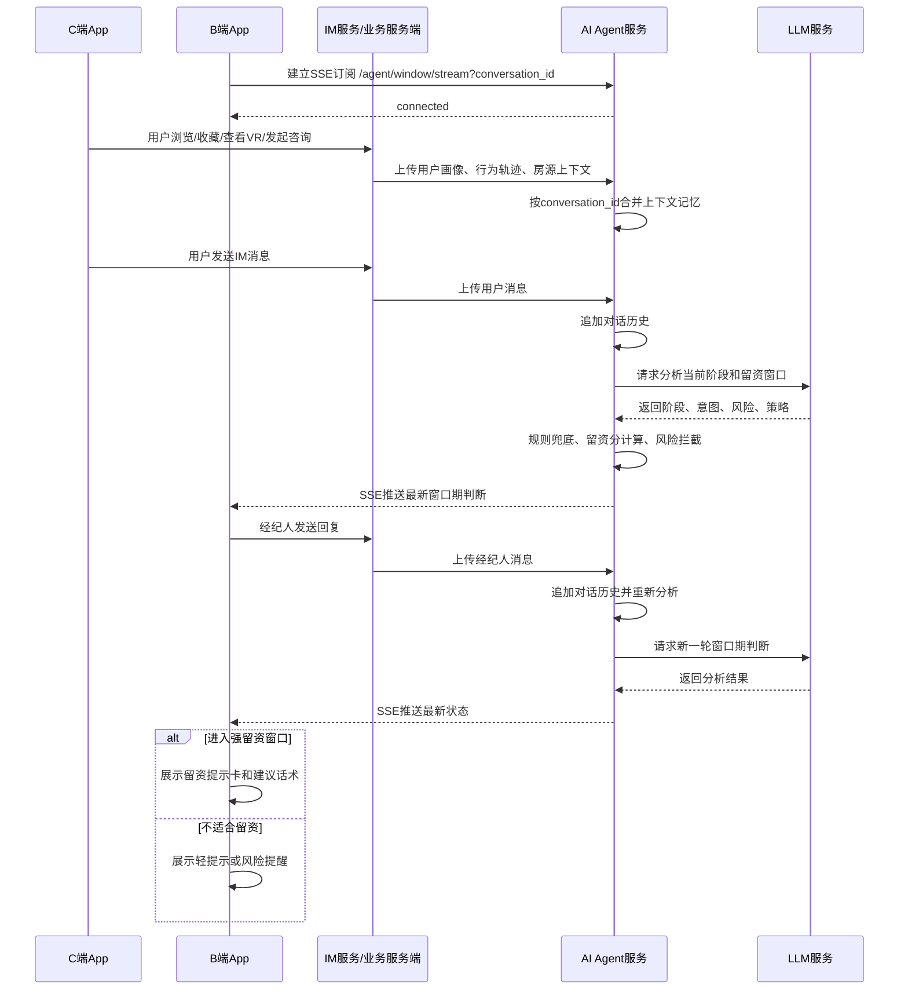
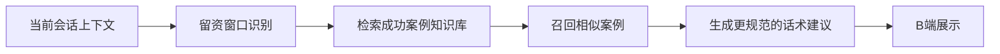

# AI 留资窗口识别项目立项文档

## 1. 项目背景

当前我爱我家找房租房 App 的核心转化链路为：用户在 C 端浏览房源，通过房源展位或经纪人入口进入 IM，与经纪人在 B 端进行沟通，经纪人通过多轮交流获取用户手机号，完成留资并推进后续电话沟通、约看和成交。

在实际业务中，用户是否愿意留下手机号，与经纪人开口时机、沟通方式、用户当前意向强度密切相关。传统方式主要依赖经纪人个人经验判断，存在以下问题：

1. 留资时机判断不稳定，新老经纪人能力差异较大。
2. 过早索要手机号容易造成用户反感或沉默。
3. 错过高意向窗口会降低 IM 到留资转化率。
4. 经纪人难以及时综合用户画像、浏览轨迹和对话内容。
5. 平台缺少可沉淀、可分析、可优化的留资窗口判断能力。

因此，本项目希望通过 AI Agent 能力，结合用户画像、浏览行为、房源上下文和 IM 对话历史，实时识别用户是否进入适合留资的窗口期，并将判断结果和沟通建议推送给 B 端经纪人，辅助经纪人在合适时机自然引导用户留资。

## 2. 项目目标

### 2.1 业务目标

1. 提升 IM 咨询到手机号留资的转化率。
2. 降低经纪人过早、重复索要手机号导致的用户流失。
3. 缩短高意向用户从咨询到留资的路径。
4. 提升经纪人在 IM 场景下的跟进效率和话术质量。

### 2.2 产品目标

1. 支持用户行为、用户画像、房源上下文和 IM 对话历史的实时上传。
2. 服务端累计维护 Agent 上下文记忆。
3. 调用 LLM 分析当前用户阶段和留资窗口。
4. 输出结构化判断结果，包括阶段、留资分、置信度、提示等级、判断原因和建议策略。
5. B 端能够实时接收当前会话的留资窗口状态。
6. 支持可视化监控页面，便于研发、产品和运营观察会话状态。

## 3. 当前建设现状

目前已完成第一阶段原型链路，整体链路为：

```text
App -> 服务端 Agent -> 本地/服务端 LLM -> Agent 判断结果 -> B 端提示/监控
```

当前已具备能力：

1. C 端或 IM 服务可累计上传用户行为、用户画像、房源上下文和对话消息。
2. 服务端可按 `conversation_id` 维护会话上下文记忆。
3. 服务端可调用 LLM 对当前会话进行分析。
4. 当前已能成功识别并提示留资窗口。
5. B 端可通过 SSE 流式订阅当前会话的窗口期判断结果。
6. 已建设本地可视化 H5 页面，可监看某个会话的当前状态、用户画像、聊天内容、留资分和窗口期判断。

当前核心输出字段：

| 字段 | 说明 |
| --- | --- |
| stage | 当前用户阶段，如需求澄清、房源兴趣、看房意向、留资窗口等 |
| lead_score | 留资窗口成熟度，0-100 |
| confidence | AI 对本次判断的置信度，0-1 |
| should_prompt_agent | 是否建议提示经纪人 |
| prompt_level | 提示等级，如 none、passive、soft、strong、warning |
| reason | 当前判断原因 |
| agent_strategy | 建议经纪人采用的沟通策略 |
| suggested_reply | 建议回复话术 |
| risk_flags | 当前风险标记，如费用顾虑、拒绝留资、流失风险等 |

## 4. 建设范围

### 4.1 本期范围

本期聚焦“留资窗口识别”能力建设。

包括：

1. 用户画像、用户行为、房源上下文、IM 对话的上下文累计。
2. 基于 LLM 的用户阶段识别。
3. 基于规则和模型的留资分计算。
4. 留资窗口期判断。
5. B 端实时推送。
6. 本地 H5 可视化监控。

### 4.2 不在本期范围

以下能力作为未来规划，不纳入当前一期交付闭环：

1. 成功留资对话知识库。
2. 基于知识库的回复规范增强。
3. 留资卡片、房源报告、户型报告等工具/物料智能推荐。
4. 自动发送卡片或物料。
5. 基于历史样本训练专用预测模型。
6. 经纪人个性化话术策略。

## 5. 核心方案

### 5.1 Agent 上下文记忆

服务端按 `conversation_id` 维护会话级上下文记忆。

上下文包括：

| 类型 | 内容 | 处理方式 |
| --- | --- | --- |
| 用户画像 | 城市、预算、区域、户型、入住时间、偏好标签 | 增量合并 |
| 浏览轨迹 | 浏览、收藏、VR、地图、户型图、停留时长、重复访问 | 追加保存 |
| 房源上下文 | 当前房源、小区、价格、户型、区域、可看状态 | 增量合并 |
| 对话历史 | 用户和经纪人的 IM 消息 | 按时间追加 |
| 分析状态 | 阶段、留资分、提示等级、风险标记 | 覆盖最新结果 |

短期策略：

1. 用户画像和房源上下文保留最新合并结果。
2. 行为轨迹保留最近 N 条。
3. 对话历史保留最近 N 条。
4. 每次新数据上传后触发一次分析。

长期策略：

1. 对长会话生成摘要。
2. 将用户需求抽取为结构化槽位。
3. 将上下文记忆从内存升级到 Redis 或数据库。

### 5.2 留资窗口识别

Agent 每次收到新上下文后，调用 LLM 进行语义分析，并结合规则进行兜底。

LLM 负责：

1. 理解用户真实意图。
2. 判断用户所处阶段。
3. 识别看房意向、费用顾虑、房源比较、拒绝留资、流失风险等信号。
4. 生成判断原因和沟通策略。

规则负责：

1. 行为信号加分，如收藏、浏览 VR、重复访问、发起 IM。
2. 画像与房源匹配加分，如预算、区域、户型匹配。
3. 明确风险扣分，如拒绝留资、费用顾虑未处理、用户说“再看看”。
4. 提示频控。
5. 防止旧请求结果覆盖新请求结果。

### 5.3 B 端实时提示

B 端进入聊天页后，通过 SSE 订阅当前会话状态。

当 Agent 识别到留资窗口时，B 端展示提示：

1. 当前是否适合留资。
2. 为什么适合。
3. 建议经纪人怎么说。
4. 当前是否有风险。
5. 是否建议先处理顾虑或继续澄清需求。

建议展示规则：

| prompt_level | 展示方式 |
| --- | --- |
| none | 不展示 |
| passive | 侧边状态展示 |
| soft | 输入框上方轻提示 |
| strong | 展示“现在适合引导留电话”提示卡 |
| warning | 提醒经纪人暂不宜索要手机号 |

## 6. 前后端交互时序图



## 7. 接口设计

### 7.1 上下文更新接口

`POST /agent/conversation/update`

用途：

上传并累计用户画像、用户行为、房源上下文和对话消息。

请求示例：

```json
{
  "conversation_id": "c_001",
  "user_profile": {
    "budget_range": [5000, 6500],
    "target_area": "朝阳",
    "room_type_preference": "一居室"
  },
  "property_context": {
    "community": "望京花园",
    "district": "朝阳",
    "price": 5800,
    "layout": "一居室"
  },
  "behaviors": [
    {"type": "view_vr"},
    {"type": "favorite"}
  ],
  "messages": [
    {"sender": "user", "content": "周末能看吗？"}
  ]
}
```

返回示例：

```json
{
  "conversation_id": "c_001",
  "stage": "visit_intent",
  "lead_score": 86,
  "confidence": 0.84,
  "should_prompt_agent": true,
  "prompt_level": "strong",
  "reason": "用户询问周末能否看房，行动意图明确。",
  "agent_strategy": "以确认看房时间为理由自然引导留手机号。",
  "suggested_reply": "这套周末可以约看，我先帮您确认房东和具体时间。方便留个电话吗？"
}
```

### 7.2 B 端订阅接口

`GET /agent/window/stream?conversation_id=c_001`

用途：

B 端实时订阅某个会话的留资窗口判断结果。

推送示例：

```text
event: analysis
data: {"conversation_id":"c_001","stage":"visit_intent","lead_score":86,"prompt_level":"strong"}
```

### 7.3 会话状态查询接口

`GET /agent/conversation/state?conversation_id=c_001`

用途：

用于 H5 监控页或问题排查，查看当前会话累计上下文和最新分析结果。

## 8. 未来规划

### 8.1 成功留资对话知识库

计划准备一批经纪人与用户成功留资的 IM 对话数据，沉淀为知识库，用于增强 AI 后续生成回复的规范性和业务贴合度。

知识库不建议只存原始对话，建议结构化加工：

| 字段 | 说明 |
| --- | --- |
| scene | 场景，如约看前留资、推荐房源留资、确认房源状态留资 |
| user_stage | 用户阶段 |
| trigger_signal | 触发信号，如询问周末看房、询问是否还在、要求推荐 |
| user_context | 用户画像和房源背景 |
| conversation_excerpt | 成功留资前 3-5 轮对话 |
| successful_reply | 经纪人成功话术 |
| why_it_worked | 成功原因 |
| do_not_say | 禁忌表达 |
| outcome | 是否留资、几轮后留资 |

未来工作流：



价值：

1. 让 AI 生成的话术更接近优秀经纪人的成功表达。
2. 减少模板化回复。
3. 提升不同场景下的话术规范性。
4. 为后续模型微调或策略优化积累数据。

### 8.2 留资卡片和物料工具推荐

计划将现有留资卡片、房源报告、户型报告等物料提供给 AI，让 AI 在合适时机判断是否建议经纪人发送工具或卡片。

可支持的动作类型：

| 动作 | 适合时机 |
| --- | --- |
| send_lead_card | 用户明确看房、需要确认房源状态、需要后续同步 |
| send_visit_booking_card | 用户明确今天、明天、周末等看房时间 |
| send_property_report | 用户关注房源真实性、价格、周边、配置 |
| send_floor_plan_report | 用户关注户型、面积、朝向、采光、布局 |
| send_similar_properties | 用户嫌贵、想比较、询问附近还有没有 |
| send_fee_explanation_card | 用户询问中介费、押金、付款方式 |
| no_action | 用户低意向、顾虑未处理、刚拒绝留资 |

未来输出结构：

```json
{
  "recommended_action": {
    "action_type": "send_lead_card",
    "priority": "high",
    "reason": "用户询问周末能否看房，适合用留资卡片承接约看确认。",
    "payload": {
      "card_type": "phone_lead_card"
    }
  }
}
```

价值：

1. 从“提示经纪人说什么”升级为“提示经纪人做什么”。
2. 用标准化卡片和物料降低经纪人操作成本。
3. 提高用户对房源信息的信任度。
4. 在看房、报告、推荐等自然场景中提升留资转化。

### 8.3 回复生成能力升级

当前已能输出基础建议话术。未来可结合：

1. 成功案例知识库。
2. 当前窗口期判断。
3. 推荐工具动作。
4. 公司现有智能回复生成 API。

形成新的回复生成链路：

```text
Agent识别窗口期
-> 检索成功案例
-> 判断是否推荐工具/卡片
-> 调用智能回复生成API
-> Agent做风控校验
-> 推送给B端经纪人
```

## 9. 风险与应对

| 风险 | 应对 |
| --- | --- |
| AI 误判窗口期 | 规则兜底、置信度阈值、经纪人确认后发送 |
| 过早提示留资 | 用户顾虑未处理时拦截，拒绝后进入冷却 |
| 话术不符合业务规范 | 接入成功案例知识库和智能回复 API，增加风控校验 |
| 旧分析结果覆盖新上下文 | 增加 version 控制，只推送最新上下文结果 |
| B 端提示过多 | 增加频控，同一会话限制强提示次数 |
| 上下文过长 | 保留最近消息，并生成会话摘要 |

## 10. 里程碑规划

### 阶段一：留资窗口识别闭环

1. 完成上下文累计。
2. 完成 LLM 窗口期识别。
3. 完成 B 端实时订阅。
4. 完成 H5 监控页。
5. 小范围联调验证。

### 阶段二：知识库增强

1. 整理成功留资对话数据。
2. 对成功案例进行结构化标注。
3. 建设向量检索知识库。
4. 在回复生成前召回相似成功案例。

### 阶段三：工具和物料推荐

1. 梳理留资卡片、房源报告、户型报告等物料。
2. 定义工具动作枚举和触发条件。
3. Agent 输出推荐动作。
4. B 端支持工具建议展示和一键发送。

### 阶段四：数据闭环和优化

1. 记录经纪人采纳、修改、忽略行为。
2. 记录提示后是否留资。
3. 评估留资率、拒绝率、沉默率和投诉率。
4. 基于真实数据优化策略和模型。

## 11. 验收指标

### 功能指标

1. 会话上下文可正确累计。
2. B 端可实时接收窗口期判断。
3. H5 监控页可查看会话状态、用户画像和聊天内容。
4. 留资窗口识别结果可解释。

### 业务指标

1. IM 留资率提升。
2. 提示后 N 分钟内留资率提升。
3. 经纪人采纳率提升。
4. 用户拒绝率和投诉率不升高。

### 体验指标

1. 经纪人认为提示有帮助。
2. 用户未感知到明显打扰。
3. B 端提示频率可控。

## 12. 总结

本项目当前已完成从 App 到服务端再到 LLM 的留资窗口识别链路，能够基于用户行为和对话历史判断当前是否适合引导用户留资。

下一阶段将围绕成功留资对话知识库和留资工具/物料推荐继续升级，使系统从“识别什么时候留资”进一步发展为“判断什么时候用什么话术、什么工具推进留资”，最终提升 IM 场景下的留资转化效率和经纪人沟通质量。
