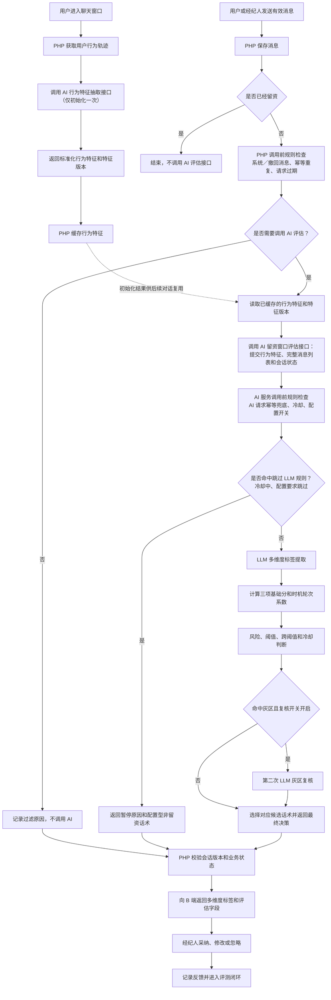
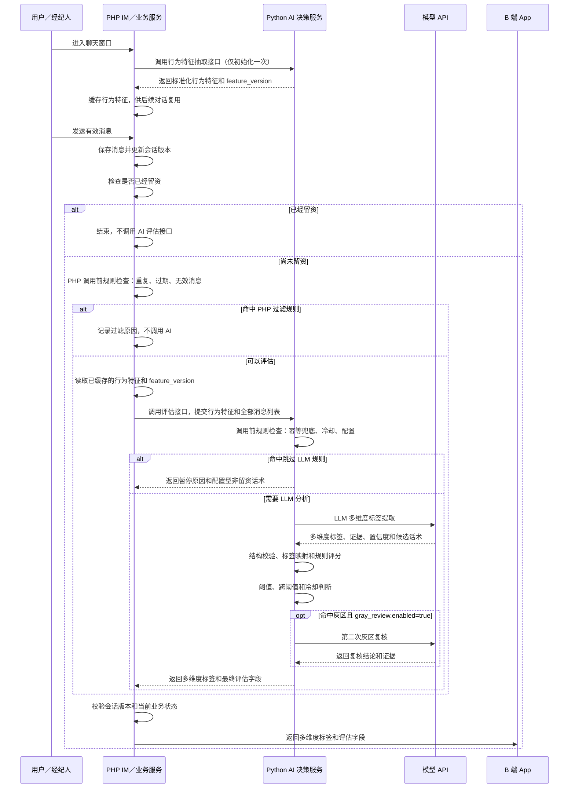
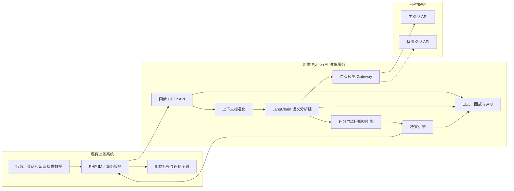
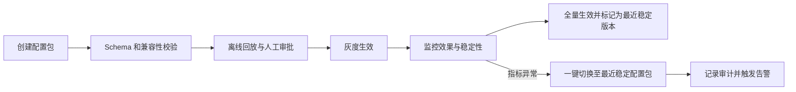

## 1. 核心结论

本方案基于用户浏览搜索轨迹，以及用户与经纪人的完整 IM 会话，实时判断当前是否进入适合索要联系方式的“留资窗口”。

一句话概括：

> LLM 负责理解“用户表达了什么”，规则引擎负责计算“值多少分、现在能不能提示”，PHP 负责决定“是否执行推送”。

## 2. 背景、目标与预期收益

### 2.1 业务问题

经纪人索要手机号或微信的时机主要依赖个人经验：

- 过早索要容易引起用户反感；
- 过晚索要可能错过约看和持续跟进机会；
- 用户行为轨迹和会话信息没有被统一利用；
- 不同经纪人的判断标准差异较大；
- 当前缺少可回放、可量化、可持续优化的判断体系。

### 2.2 建设目标

每次用户或经纪人发送有效消息后，PHP 一期通过同步 HTTP 调用 AI 服务并获得判断结果：

- 留资窗口总分和等级；
- 形成窗口的核心理由；
- 拒绝、重复索要等风险；
- 是否应向经纪人展示提示；
- 本次推荐话术；
- 会话是否结束，以及结束原因、证据和置信度。

AI 只辅助经纪人判断，不自动向用户索要联系方式。

### 2.3 预期收益

业务收益：

- 提高有效留资率和后续约看转化；
- 降低过早、重复索要造成的用户打扰；
- 提升经纪人发现高意向用户的效率；
- 降低经纪人经验差异带来的转化波动。

技术收益：

- 建立统一 AI 决策服务和模型适配层；
- 支持 Prompt、模型、规则独立灰度和回滚；
- 支持离线回放、A/B 实验和效果评测；
- 为后续智能跟进 Agent 保留演进空间。

收益提升比例不在一期预设，通过影子模式和 A/B 实验验证。

## 3. 完整业务流程与系统交互

### 3.1 业务流程



### 3.2 系统交互时序



### 3.3 关键数据流

输入数据：

- AI 行为特征抽取接口生成的标准化特征：浏览、重复查看、收藏、地图、VR、搜索条件收窄等；
- 当前会话的全部消息列表，不截断为最近若干轮；
- 当前轮次、会话时长、索要历史、弹窗历史。

已留资状态不作为 AI 请求字段使用。PHP 在调用前完成判断，已留资会话不调用 AI 接口。

输出结果：

- 三项基础分、时机轮次系数和最终分；
- 窗口等级；
- 多维度标签：意向、需求、留资时机、风险、会话状态等；
- 留资理由和证据消息；
- 风险及暂停原因；
- 推荐话术；
- 会话是否结束；结束时的原因、证据消息和置信度；
- Prompt、模型和规则版本。

行为轨迹由 AI 后端的独立接口在用户进入聊天窗口时抽取一次，形成结构化特征。特征抽取采用确定性代码和配置规则，不调用 LLM；结果携带 `feature_version`，由 PHP 缓存并在后续对话评估中复用，支持缓存、回放和规则升级。留资窗口评估接口只消费已初始化的标准化特征，不直接将大量原始行为流水传给 LLM；它按每条有效消息触发。会话消息按当前需求每次完整上送；针对超长会话，需要在压测后设计 Token 上限、摘要或分段等工程保护，但不能在未确认前改变“完整上送”的业务语义。

## 4. 新增服务与技术选型

### 4.1 为什么不全部放在 PHP 后端

如果将模型 SDK、Prompt、多项语义判断、规则评分和模型切换全部写入 PHP：

- AI 能力与业务代码强耦合；
- Prompt 和规则变更需要跟随业务发布；
- 模型切换、离线评测和灰度实验实现成本高；
- 后续引入多模型、复核链路或 Agent 时重构范围大。

因此新增独立 Python AI 决策服务，PHP 与 AI 服务通过稳定协议交互。

### 4.2 方案对比

| 方案                          | 优点                    | 主要问题             | 结论              |
| --------------------------- | --------------------- | ---------------- | --------------- |
| Coze 平台                     | 上手快、可视化、适合产品调试        | 平台锁定、精细测试和链路控制受限 | 用于原型和 Prompt 实验 |
| PHP 直接调用模型                  | 一期改造最少                | AI 与业务强耦合，扩展成本高  | 不作为长期方案         |
| Python + LangChain + 原生 API | 兼顾交付速度、模型适配、结构化输出和扩展性 | 需限制框架边界          | 一期选择            |


### 4.3 一期推荐架构



推荐技术栈：

| 层次        | 一期选择                          |
| --------- | ----------------------------- |
| 服务语言      | Python                        |
| Web 与数据校验 | FastAPI + Pydantic            |
| 模型交互      | LangChain 基础组件                |
| 模型调用      | 原生模型 API，通过自有 Gateway 适配      |
| 业务编排      | 普通 Python Application Service |
| 评分规则      | 自建、配置化规则引擎                    |
| 状态与缓存     | 业务数据库 + Redis 或现有统一组件         |
| 服务交互      | 一期使用同步 HTTP，不引入 MQ            |

LangChain 只用于模型适配、Prompt 和结构化输出，不承担业务状态、评分规则和最终动作。未来引入 LangGraph 时仅替换 AI 服务内部编排，PHP 接口保持不变。

## 5. LLM 与规则引擎如何分工

### 5.1 职责原则

| 能力                 |  LLM |      规则引擎／业务后端 |
| ------------------ | ---: | -------------: |
| 理解用户和经纪人会话语义       |    是 |              否 |
| 提取预算、区域、户型等需求      |    是 |         按完整度计分 |
| 识别约看、加微信、继续推荐等理由   |    是 |        按类型映射分值 |
| 识别拒绝、反感、犹豫等语义风险    |    是 |       执行扣分或硬拦截 |
| 判断会话是否已经结束并给出证据    |    是 |      作为会话状态标签返回 |
| 生成不同动作的候选话术        |    是 | 根据最终决策选择本次推荐话术 |
| 抽取浏览、收藏、VR 和搜索行为特征 |    否 |   AI 后端确定性特征服务 |
| 计算轮次、时长、索要和弹窗次数    |    否 |              是 |
| 最终加权、80 分阈值和冷却     |    否 |              是 |
| B 端如何展示和处理标签字段      |    否 |       B 端按字段处理 |

LLM 输出意向、需求、留资时机、风险、会话状态等多维度标签，以及候选话术、证据和置信度，不直接自由生成最终分数。规则引擎将标签映射成三项基础分，计算时机轮次系数，并根据最终动作从候选话术中选择本次推荐话术；标签与评估结果均以字段形式返回 B 端。

规则检查分为两层：

1. PHP 调用前过滤：已留资、系统消息、撤回消息、重复消息和请求过期时不调用 AI；
2. AI 调用前规则检查：执行请求幂等兜底、冷却、配置开关和灰度范围判断；命中后跳过 LLM；

### 5.2 三项基础分、时机系数与风险

| 维度 | 权重 | LLM 负责 | 规则引擎负责 |
|---|---:|---|---|
| 用户意向 | 35% | 会话意向等级、类型和证据 | 行为意向计算、等级映射和合成 |
| 需求明确 | 30% | 提取需求槽位及明确、推测、未知、冲突状态 | 根据槽位完整度计分 |
| 核心留资理由 | 35% | 识别约看、微信、推荐、确认房源等理由 | 根据理由类型和强度映射分值 |
| 时机轮次 | 总分系数 | 不单独评分 | 根据轮次、时间、最近强意向和索要历史计算系数 |
| 负向与打扰风险 | 扣分或拦截 | 识别拒绝、反感、不考虑和不匹配 | 识别重复索要、冷却并执行扣分或暂停 |

建议公式：

```text
基础分 =
    用户意向分 × 35%
  + 需求明确分 × 30%
  + 核心留资理由分 × 35%

时机修正分 = min(100, 基础分 × 时机轮次系数)

最终分 = max(0, 时机修正分 - 软风险扣分)
```

第 1～3 轮以抑制过早索要为主，第 4～10 轮在存在有效沟通或近期强意向时提升系数，超过重点区间后逐步衰减。每个轮次对应的具体系数由历史数据校准并配置化，不在本版固化。

风险和会话状态均以标签字段返回 B 端，其中风险标签包括：

- 用户明确拒绝联系方式；
- 已租到或明确不考虑；
- 用户反感联系；
- 短时间重复索要；
- 当前处于弹窗冷却期。
- 模型判断会话已经结束。

会话状态标签必须包含：`ended`、`reason_code`、可读原因、证据消息 ID 和置信度。`ended=true` 时，评估接口返回适合结束或礼貌收尾的推荐话术，由 B 端结合标签字段处理。

### 5.3 80 分弹窗逻辑

一期暂定：

```text
调用前规则检查通过
    且最终分大于80分
    且不在弹窗冷却期
    且分析结果仍对应最新会话版本
    且 PHP 调用前已确认尚未成功留资
→ 向经纪人端展示留资提示
```

具体行为计分、槽位分值、冷却时间和重复索要规则均配置化，并通过离线数据与灰度实验校准。

## 6. 评估LLM 调用

### 6.1 一次统一多维标签提取

- 模型先提取多维度标签，不直接计算最终分数；
- 每个维度必须提供独立证据；
- Prompt 明确禁止一个强信号自动提高全部维度；
- 使用严格 JSON Schema；
- 规则引擎完成映射和最终计算。

为避免为了话术再调用一次模型，首次 LLM 调用同时生成 `contact_request`、`continue_chat`、`close_conversation` 等动作的候选话术。规则引擎根据会话结束状态、最终分和风险结果选择一个作为评估接口的 `recommended_reply` 返回。
### 6.2 推荐策略

#### 默认链路

```text
一次 LLM 统一事实抽取
→ 规则引擎计算三项基础分和时机轮次系数
→ 80 分阈值判断
```

#### 灰区复核

准确率优化优先采用可开关的阈值灰区复核，不将意向、需求、留资理由和风险拆成多次调用。

- 服务端通过 `gray_review.enabled` 控制是否启用；
- 仅在开关开启且首次结果命中配置区间时，调用第二次 LLM；
- 开关关闭时，直接使用首次分析结果；
- 复核超时或失败时，降级使用首次结果，主评估接口仍正常返回。

分项并行方案仅保留为离线对照实验，是否采用以业务准确率、误弹率、延迟和成本为准。

## 7. AI 引擎接口与可靠性

### 7.1 用户行为特征抽取接口

```text
POST /v1/user-behavior/features/extract
```

#### 调用时机与复用

- 用户进入聊天窗口时，PHP 调用一次该接口完成初始化；
- PHP 缓存返回的行为特征及其版本；
- 同一聊天窗口后续有效消息不重复调用，而是在评估请求中复用初始化结果。

#### 输入与输出

| 类型 | 字段 |
| --- | --- |
| 关键输入 | `request_id`、`user_id`、统计时间范围、用户行为轨迹 |
| 关键输出 | 标准化行为特征、`feature_version`、统计时间范围、生成时间 |

#### 可靠性与降级

- 接口应支持幂等、缓存和回放；
- 特征缺失时，返回默认值与缺失标记，不调用 LLM；
- 接口异常时，PHP 携带“行为特征不可用”标记继续发起评估；
- AI 服务仅依据会话信息判断并降低结果置信度，不得因缺失行为特征直接提高分数。

### 7.2 留资窗口评估接口

```text
POST /v1/lead-window/evaluate
```

关键输入：

- `request_id`；
- `conversation_id` 和 `conversation_version`；
- 触发消息；
- 行为特征及 `feature_version`；
- 当前会话的全部消息列表；
- 会话状态。

关键输出：

- 三项基础分、时机轮次系数和最终分；
- `window_level`；
- 多维度标签字段：意向、需求、留资时机、风险、会话状态等；
- 留资理由、风险和证据；
- 推荐话术；
- `conversation_end.ended`；
- 会话结束时的 `reason_code`、原因、证据消息 ID 和置信度；
- `prompt_version`、`rule_version`、`model_profile`；
- 分析时间和状态；
- 灰区复核状态：是否命中灰区、开关是否开启、是否实际复核和复核版本。

### 7.3 可靠性设计
- `request_id + trigger_message_id` 保证幂等；
- 每条消息更新 `conversation_version`，旧结果自动丢弃；
- 模型调用设置超时和有限重试；
- 主模型失败可切换备用模型；
- 结构化输出校验失败时只进行有限修复；
- 行为特征抽取失败时降级为仅依据会话评估，并显式标记特征不可用；
- 灰区复核开关、分数区间和复核模型均配置化，变更可审计、可回滚；
- Prompt、模型和规则全部版本化、可灰度、可回滚。

### 7.4 动态配置与一键回滚设计

#### 设计目标

模型、Prompt、评分规则和灰度策略均不随业务代码发布。AI 服务在每次评估开始时读取一个完整、可追溯的配置快照；全量前可一键切回最近稳定版本，不影响已在执行的请求。

#### 配置包与版本管理

以 `config_bundle_id` 作为一次生效配置的唯一标识，一个配置包固定绑定以下不可变版本：

| 配置项 | 示例内容 |
| --- | --- |
| 模型配置 | `model_profile`、主备模型、超时、重试、温度等 |
| Prompt 配置 | `prompt_version`、模板、JSON Schema、标签定义 |
| 规则配置 | `rule_version`、阈值、权重、冷却期、风险扣分 |
| 灰度配置 | 生效环境、人群范围、流量比例、`gray_review.enabled` |

- 已发布的配置包不可直接修改；任何变更都创建新版本；
- 配置中心仅维护各环境的“当前生效配置包”和“最近稳定配置包”两个指针；
- 每个评估结果写入 `config_bundle_id`、模型、Prompt 和规则版本，支持问题回放与效果归因。

#### 发布与生效流程



配置变更在配置中心通过原子更新“当前生效配置包”指针完成。服务实例通过订阅通知或短 TTL 本地缓存获取新指针；一次请求开始后固定使用其读取到的配置快照，避免同一请求混用不同版本。

#### 一键回滚机制

- 控制台提供“回滚至最近稳定版本”和“回滚至指定配置包”两个操作；
- 回滚仅原子切换生效指针，不修改历史配置包或业务代码；
- 切换后新请求立即使用回滚版本，在途请求继续按原快照完成；
- 配置缓存收到失效通知后主动刷新；若通知失败，最长在 TTL 到期后刷新；
- 回滚操作记录操作者、时间、原因、回滚前后版本和影响范围，并发送告警。

#### 全量前准入与演练

全量前必须在预发和灰度环境完成至少一次模型、Prompt、规则各自变更及组合配置包的回滚演练，并验证：

- 新请求可在约定恢复时限内切回稳定配置包；
- 结果中的版本字段与实际配置快照一致；
- 缓存刷新、审计记录、监控告警和离线回放均正常；
- 回滚后提示准确率、误弹率、超时率和成本等指标恢复至稳定基线。

## 8. 测试、指标与上线计划

### 8.1 离线测试

建立脱敏人工标注集，覆盖：

- 强意向、约看、加微信；
- 高浏览但没有真实租房意图；
- 需求明确但拒绝留资；
- 约看意愿强但需求不完整；
- 用户反感和重复索要；
- 明确结束、继续沟通和暂时中断等会话状态；
- 已留资会话不调用 AI 接口的 PHP 前置过滤；
- 行为特征抽取的事件口径、缺失值、幂等、缓存和版本兼容；
- 灰区内开关开启／关闭、灰区外不复核以及复核失败降级；
- 方言、口语、错别字、连续短消息；
- 阈值附近和模型容易混淆的样本。

重点指标：

| 类型   | 指标                                       |
| ---- | ---------------------------------------- |
| 语义抽取 | 意向等级准确率、需求槽位 Precision／Recall／F1、理由类型准确率 |
| 会话结束 | 结束判断 Precision／Recall／F1、原因类型准确率、证据有效率   |
| 风险控制 | 风险 Recall、硬风险漏识别率                        |
| 最终决策 | 提示 Precision／Recall、误弹率、漏弹率              |
| 可解释性 | 证据有效率、结构化输出成功率                           |
| 稳定性  | 相同输入重复调用的一致性                             |

其中误弹率和风险 Recall 优先级高于单纯提高提示 Recall，避免为了覆盖更多机会而增加用户打扰。

### 8.2 工程指标

- 端到端延迟 P50／P95／P99；
- 模型调用延迟 P50／P95／P99；
- AI 服务成功率、模型超时率和降级率；
- JSON／Schema 解析失败率；
- 同步 HTTP 连接失败率和超时率；
- 单次 Token 和调用成本；
- 主、备用模型使用比例；
- 行为特征抽取接口延迟、成功率和缓存命中率；
- 灰区命中率、实际复核率、复核增加的延迟和 Token 成本。

### 8.3 在线业务指标

- 提示曝光率；
- 经纪人采纳、修改和忽略率；
- 提示后留资率；
- 实验组相对对照组的增量留资率；
- 用户拒绝、反感和会话流失率；

### 8.4 上线阶段

1. 离线回放：验证 Prompt 和规则；
2. 影子模式：线上分析但不弹窗；
3. 内部白名单：测试经纪人可见；
4. 小流量 A/B：验证增量留资率和打扰风险；
5. 全量前完成模型、Prompt 和规则的一键回滚演练，并满足 7.4 节准入要求。

确认后进入详细设计：接口 Schema、Prompt、规则配置、样本标注、压测目标和灰度计划。
