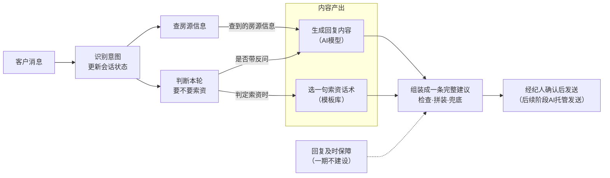

# 租房在线聊AI助手 产品需求文档（PRD）

## 一、业务目标

### 1.1 我们要做什么

做一个嵌入租房在线聊的AI助手，辅助（成熟后托管）经纪人接待客户，核心逻辑是：**将高留资率经纪人的对话策略产品化，通过AI在会话中实时生成回复，复用到每一场会话**。

策略来源于头尾部经纪人约20万条真实会话消息的对比分析，留资率差异可完备地分解为四个可产品化的策略因素：

| 策略因素 | 管什么 |
|---|---|
| ① 回复及时策略（底座） | 回不回、多快回 |
| ② 索资时机策略 | 这一轮回复中要不要发起索资（索要联系方式，下同） |
| ③ 索资话术策略 | 索资这句话怎么说 |
| ④ 会话加热策略 | 非索资内容（答疑/反问）怎么说 |

四个策略生效的前提是AI能先解决客户当前问题（房源问答、资料、看房等**基础服务能力**）。策略+基础服务共同构成AI助手的完整能力。

### 1.2 业务指标与目标

**指标口径**——用户留资率：按「会话-天」维度统计，用户留资的会话数 / 所有会话数（用户留电话、留微信或通过平台卡片确认留电；所有会话=用户当天至少发送一条消息的会话）。

**数据现状与目标**：

| 时间段 | 平均留资率 |
|---|---|
| 2025.6.22 – 2025.7.21 | 22.31% |
| 2025.12.1 – 2025.12.31 | 19.49% |
| 2026.6.22 – 2026.7.21 | 19.43%（同比 −12.92%） |
| 2026.12 自然趋势预测 | 16.97% |
| **2026.12 产品目标** | **18.67%**（自然趋势基础上 +10%） |

### 1.3 业务目标对产品的核心要求

从业务目标拆解，产品设计上要解决五个核心问题：

1. **实时识别客户意图和会话状态**：客户每发一条消息，都要立即识别出他在问什么、想干什么（约看、确认在租、问房源细节等），并持续掌握会话的整体状态（客户聊得热不热、要过几次联系方式、留没留资）——这是四个策略共用的判断依据。识别必须用AI模型理解语义，而不是关键词匹配：数据表明按关键词识别时"无明确意图"仍占68%，大量真实意图会被漏掉。
2. **策略按明确规则稳定执行**：什么时候要联系方式、索资这句话怎么说、加热怎么聊，都已由数据量化为明确规则（如客户主动发言满2条就索资、索资句不超过15字）。产品上要保证这些规则被逐条稳定执行，而不是交给AI"自由发挥"——规则决定做不做，AI只负责把内容说自然。
3. **回答必须基于真实房源信息**：客户问题的54.4%是房源信息咨询，回答必须来自平台真实房源数据；查不到的信息明确答"帮您核实"，绝不编造——不说错话是基础服务的生命线。
4. **秒级响应**：在线聊的转化窗口极短——客户刚发言1分钟内索要联系方式成功率28.1%，静默30分钟后只剩2.5%。回复建议必须在秒级生成，慢了策略窗口就关闭了。
5. **人机发送权限的清晰管理**（二期起）：从"AI建议、人来发"演进到"AI直接发"，任何时刻谁有权发消息必须唯一、清晰、可追溯，人机切换即时生效。

一期MVP以**单条辅助话术**为载体（AI生成建议、经纪人确认后发送），验证回复质量与留资提升效果；验证通过后按演进路径逐步开放AI自动发送权限。

## 二、产品架构

### 2.1 总体设计思路

四条设计原则：

1. **服务优先**：基础回答不能被索资替代——先回答客户的房源问题或完成必要动作，再做留资转化。
2. **状态共享**：客户的意图、需求、聊天热度、要过几次联系方式、有没有被拒、是否已留资，统一记录在一个"会话状态"中，所有模块实时共用同一份信息；这份状态也是后续人机切换时双方对齐的唯一依据。
3. **决策与内容分离**："要不要索资"由规则判断（可解释、可调整、可做A/B实验），"话怎么说"由内容模块产出（受规则约束）——规则决定做不做，内容只管说得自然。
4. **生成与发送解耦**：回复内容的生成方式在各阶段完全一致，变的只是"谁来发"——一期AI只出建议、经纪人确认后发送，后续阶段开放AI直接发送，内容生成部分不用改。

### 2.2 产品架构图



**整体数据流一句话**：客户消息 → 识别意图和状态 → 查房源信息 ＋ 判断要不要索资（并行）→ 生成回复内容（若索资，另从模板库选一句索资短句）→ 组装成一条建议 → 经纪人确认后发送 → 结果回写状态，驱动下一轮。逐步细节见2.4。

### 2.3 七个模块的职责分工

| 模块 | 是否用AI模型 | 职责（一句话） |
|---|---|---|
| 会话状态中心 | 用（理解客户消息） | 识别客户每条消息的意图，并持续记录会话状态（热度、需求、索资历史、是否已留资） |
| 基础服务能力 | 不用（查数据） | 按客户问题查出对应的真实房源信息，查不到的标记"需核实" |
| 索资时机决策 | 不用（按规则判断） | 按数据规则判断本轮回复要不要索要联系方式 |
| 索资话术选择 | 不用（模板库选择） | 从经过数据验证的模板库中选一句合规的索资短句 |
| 会话加热生成 | **用（全链路唯一的文案生成点）** | 引用查到的房源信息生成回答；不索资时追加一个反问引导客户多聊 |
| 回复组装与输出 | 不用（按规则检查拼装） | 把回答和索资句组装成一条完整建议，检查合规后输出 |
| 回复及时保障 | 一期不建设 | 监控客户消息是否被及时回复（二、三期随AI发送权限启用） |

分工一句话总结：**基础服务供事实，时机决策管"要不要"，加热生成管"怎么说"（全链路唯一的AI文案生成点），索资话术走模板库，回复组装做最后把关，回复及时是贯穿全程的保障层。**

### 2.4 单轮处理流程

客户每发一条消息，系统按以下六步执行：

1. **识别**：识别当前消息的意图，更新会话状态；客户已留资则关闭一切索资。
2. **取数**：按客户问题查出真实房源信息，查不到的标记"需核实"。
3. **决策**：判断本轮要不要索资——约看、确认在租、索要照片视频等强信号立即触发；常规场景看客户主动发言条数（满2条）和会话时长。
4. **生成**：AI模型引用查到的房源信息生成回复正文（不索资时带一个加热反问）；若索资，从模板库选一句索资短句。
5. **组装**：检查正文（长度、事实、违规反问），按"回答在前、索资句在后"拼装，风险意图换安全兜底话术，输出一条完整建议。
6. **回流**：回复发出后，客户的回应、需求变化、拒绝或留资结果回写会话状态，驱动下一轮判断。

两个关键约束：

- **每轮最多两次AI模型处理**：一次理解客户消息（第1步）、一次生成回复文案（第4步），其余全部是确定性规则——这是控制成本和响应速度的根本设计。
- **建议永远基于最新消息**：客户发来新消息、或经纪人已自行回复时，正在处理/已生成的旧建议立即作废，基于最新内容重新走一遍流程（详见第五章）。

## 三、功能模块详细说明

**统一设计基准：所有模块按"AI直接发出、无人把关"的托管标准设计。** 辅助话术与托管形态的差别只在"谁来发送"，识别、状态、决策、生成的全部逻辑一次建成，形态演进不再改动。由此推论：所有安全机制（不编造、不假承诺、不重复索资）必须内建在流程中，**不允许以"一期有经纪人把关"为由省略**——托管开启时没有人工兜底。

### 3.1 客户意图与会话状态识别

所有模块共用的输入层，负责两件事：**识别客户每条消息的意图**、**持续维护会话状态**。它的准确性决定全链路的上限——意图判错则索资时机判错，发言条数记错则触发规则失灵。

#### 3.1.1 识别什么

**（1）消息意图**。客户每发一条消息，AI模型结合上下文识别他在问什么、想干什么。意图体系为已验证的5大类、81个细分意图（房源基础信息 / 价格费用 / 需求推荐 / 看房 / 其他，完整定义见《租客消息意图识别统计需求文档》）。识别必须结合上下文：客户的"可以""明天呢"这类短回复，单看这一句无法理解，要还原成完整含义（如"客户同意看房，问明天下午能否看"）。

其中三类意图是**强信号**——数据表明客户发出这些消息时索资成功率最高，识别到即立即触发索资（规则见3.3）：

| 强信号 | 单次索资成功率 | 说明 |
|---|---|---|
| 约看类（要求看房/问看房时间/确认时间） | 41.8% | 全部意图中最高 |
| 确认在租（"房子还在吗"） | 33.7% | 客户筛选完成、行动前的最后确认 |
| 索取照片/视频/链接 | 28.7% | 自带索资理由（"留微信发您实拍"） |

**（2）随消息附带识别的两项信息**（与意图识别在同一次AI模型处理中完成，不额外增加耗时和成本）：

1. **客户需求**：消息中新提到或修改的租房需求——预算、入住时间、居住人数、区域/户型偏好。只记客户原话（如"5000以内"），不做推测。
2. **是否拒绝留资**：客户是否在拒绝提供联系方式（"不用了""先不留""加了你也不看房"这类口语化表达，关键词识别不了，必须靠AI结合上下文判断）。规则：只有此前确实被索要过联系方式、且当前消息明确拒绝，才算拒绝；客户拒绝其他事项（拒绝推荐、拒绝某个看房时间）不算；无法确定时不算——判漏一次拒绝的代价（拒后再要惹反感）高于判错。

#### 3.1.2 维护什么状态

会话状态按"会话-天"维度维护（与留资率统计口径一致），包含七项：

| 状态项 | 是什么 | 关键规则 | 谁用 |
|---|---|---|---|
| 客户主动发言条数 | 客户真实发言的条数 | **剔除系统模板消息**（如开场标准语"要求详细介绍房源"）——模板消息不代表客户真实热度 | 索资时机主轴（满2条触发）、话术冷热分场景 |
| 客户最近发言时间 | 客户最后一条消息的时间 | — | 判断客户是否还在线 |
| 会话开始时间 | 当天客户第一条消息的时间 | 写一次不再变 | 计算会话进行了多久（4分钟止损的依据） |
| 经纪人回应状态 | ①是否已至少1次人工回应（自动回复不算）；②是否处于"独角戏"（客户只回0-1条、经纪人已连发6条+） | — | 索资的先决条件（3.3门槛G4） |
| 是否已留资 | 初始为"未留资"，一旦留资永不回退 | 主路径走平台既有留资识别（卡片确认+文本识别电话/微信），要求**秒级同步**——已留资后还建议索资是最刺眼的坏case。兜底：AI识别到客户主动提供联系方式也标记为已留资——宁可错关索资，不可对已留客户重复索要 | 全局开关：已留资**关闭一切索资** |
| 索资历史 | 每次索资的时间、话术原文、理由类型、是否被拒 | 三条关键规则见下 | 时机决策（软上限/重试）、话术（禁复读/换理由） |
| 客户需求画像 | 多轮对话累积的预算、入住时间、居住人数、偏好 | 只增不删，新值覆盖旧值 | 加热反问去重（问过的不再问）、索资话术填变量 |

**索资历史的三条关键规则**：

1. **以消息实际发出为准**：AI生成了索资建议但经纪人没发，不计入——按生成计数会虚增，导致该要的时候不敢要。
2. **人机共享计数**：经纪人手打的索资和采纳AI建议发出的索资统一计数（一期两者都是经纪人消息，按"是否发了留资卡片+是否含'电话/微信/联系方式'等关键词"识别）——保证整个会话不重复索资，后续人机切换时计数连续。
3. **被拒标记**：AI判定客户拒绝留资时（3.1.1），把"被拒"标到最近一次索资记录上，并归类当次索资的理由（发房源/约看/发实拍等）——供话术模块"被拒后换新理由"使用。

#### 3.1.3 哪些识别不用AI模型

以下是确定性判断，走规则不走AI，保证零误差：

| 识别项 | 怎么做 | 用途 |
|---|---|---|
| 模板消息识别 | 平台在消息源头打标（对平台的硬需求，见第四章） | 发言条数剔除；开场标准语直接映射意图，不过AI |
| 经纪人索资识别 | 留资卡片发送事件 + 文字关键词（沿用数据分析口径） | 索资历史记录 |
| 自动回复识别 | 消息自带的[自动回复]标记 | 不计入人工回应 |
| 留资识别（主路径） | 平台既有能力：卡片确认 + 文本识别电话/微信 | 已留资标记 |

#### 3.1.4 处理顺序要求

同一条客户消息必须按"识别→更新状态→策略判断"的顺序完成，多条消息按到达先后依次处理——否则发言条数等状态会错乱，触发规则跟着出错。每条消息只处理一次，不重复。

> **小结：AI模型在一次处理中完成三项识别（意图/需求/是否拒绝留资）；发言条数、索资识别、留资识别主路径等确定性判断全部走规则；一期即建成人机共享的完整会话状态，二期托管直接复用。**

### 3.2 房源信息供给

**模块定位一句话：为回复供给当前问题所需要的可信房源信息，仅此而已。** 不判断要不要索资（3.3的事）、不组织语言（3.5的事）。它服务的是最大基本盘：房源信息咨询占全部客户问题的54.4%、覆盖90%的会话——房租楼层都答不上就伸手要联系方式，只会损害信任。

**只查信息、不写文案**，查出的信息交给生成模块（3.5）组织成话。理由：事实与表达分开，防编造才有抓手——生成回复只允许引用本模块查出的信息，AI不能"凭自己知道的"谈房源；事实错误必出在查询环节、表达问题必出在生成环节，可分别定位。

#### 3.2.1 三种查询结果

客户每条消息按意图查询房源信息，结果必为三种之一：

| 结果 | 含义 | 后续处理 |
|---|---|---|
| 查到了 | 客户问的信息有真实数据（如租金4800、12层有电梯） | 交给生成模块引用作答 |
| 该有但缺失 | 客户问的是房源事实，但数据为空或已过期 | 统一回复"这个我帮您和业主核实下"，**禁止编造** |
| 与房源信息无关 | 问候、闲聊、约看、要照片、议价等，无需查数据 | 按对话规则正常应答（约看积极响应——房态默认可看；风险意图走安全话术，见3.2.3） |

**红线：宁可多说"帮您核实"，不可编造任何房源信息**——这是上线的第一条件。

#### 3.2.2 查询范围与配置

1. **意图→信息映射**：每类房源问题对应查哪些信息（问租金→查租金和付款方式；问楼层→查楼层、总楼层、电梯；问费用→查水电燃气单价……），映射关系对照业务后台真实数据建设。
2. **开放式提问**：客户说"详细介绍下"时，提炼2-3个关键卖点信息，不全量罗列。
3. **后台没有的信息**：客户高频问、但后台根本没有的数据（如"临不临街""装修年代"），配置时直接标为"固定核实"——客户问的是事实，答非所问的套话不如"帮您核实"。建设映射时顺带产出一份"客户高频问但后台没有的信息清单"，反向推动房源数据补录。
4. **一条消息问多件事**：逐项查询、合并结果，生成模块在一条回复内一并回答。

#### 3.2.3 风险意图的固定安全话术

议价、投诉、存量合同等风险问题**不禁答**（托管形态下安全应答优于沉默），用固定配置的安全话术回复，不依赖AI自由发挥：

| 风险意图 | 安全话术 | 本轮可否索资 |
|---|---|---|
| 议价 | "价格我帮您和业主争取下" | **可以**——议价的风险只在"不能替业主承诺降价"，安全话术已管住承诺；且"帮您争取"天然衔接"留个联系方式" |
| 投诉纠纷 | "您的情况我记下了，马上帮您反馈处理" | 不可以——投诉时索资是火上浇油 |
| 存量合同/售后 | "我帮您问下门店，稍后回复您" | 不可以——已签约客户不在留资转化范围内 |

话术清单为运营配置，可随时扩充调整。

#### 3.2.4 一期明确不做

1. **无业务知识库**：非房源问题按对话规则应答，后续加知识库是纯增量。
2. **无房源推荐检索、无预约看房工具**：客户要求推荐时正常对话应答。
3. **不校验照片/视频是否存在**："留微信发您实拍"的兑现方是留资后的经纪人（线下发图），AI任何阶段都不自动发送媒体，校验无意义。

> **小结：本模块收敛到极简——按客户问题查真实房源信息，输出"查到了/该有但缺失/与房源无关"三种结果；防编造的机制保障是"生成回复只能引用查到的信息"；风险意图用固定安全话术，议价可索资、投诉/存量不可。**

### 3.3 索资时机决策

全链路的决策核心，回答一个问题：**本轮回复要不要带上索要联系方式**。只做判断，话怎么说归3.4，回答怎么写归3.5。

判断走**明确规则，不用AI**：全部判断依据（发言条数、意图信号、索资历史）已由数据量化出明确阈值；每一次索资都要能精确回答"为什么这轮要了"，才能归因、调参、做A/B实验；"已留资不再索资"这类硬约束绝不能有概率性失误。

#### 3.3.1 决策规则（按步骤顺序执行，命中即定）

```
── 第一步 硬性门槛（任一命中 → 本轮不索资，只做加热回复）─────────
G1 已留资 → 停止一切索资
   [全局开关，最高优先级]
G2 本会话已索资满5次 → 停止，只维护对话
   [软上限保险丝：第4次起挽回量骤减，继续要只剩骚扰风险；上限可A/B调整]
G3 上次索资被拒 且 本轮无强信号 → 不索资，先提供价值
   [被拒后从严，等强信号再现才重试：有新信号重试10.2% vs 盲目重试6.8%；
    普通失败（没回应但没拒绝）不进此门槛，客户一有新回应即恢复索资资格]
G4 经纪人还没人工回应过 或 正处于"独角戏"（客户只回0-1条、经纪人已连发6条+）
   → 不索资
   [别在没答过客户话时伸手；独角戏成功率仅7.5%-18.1%，先引出客户回应]

── 第二步 强信号立即触发（命中 → 本轮索资）──────────────────
T1 客户表达约看意向 → 立即索资，理由绑定"约业主时间"
   [41.8%全维度最高；约看信号后索要的会话留资率48.8% vs 没要19.6%]
T2 客户确认房子是否在租 → 立即索资，先答"在的"再以约看为理由
   [33.7%，次强信号：客户筛选完成、行动前的最后确认]
T3 客户索要照片/视频 → 立即索资，理由绑定"加微信发您实拍"
   [28.7%，自带索资理由]
   ※ 若发生在"上次被拒"之后（G3因强信号放行），属被拒后重试，
     话术必须换新理由（3.4执行）

── 第三步 常规触发（无强信号时，主轴=客户主动发言条数）──────────
S1 主动发言满2条 → 立即索资
   [2条是成功率跳变点31.9%；达标后每多等一分钟成功率单调下降，没有理由再等]
S2 不满2条 且 会话未满4分钟 → 本轮不索资，做加热回复（答疑+反问）
   [目标是引出客户的第2条真实发言]
S3 不满2条 且 会话已到第4分钟 → 止损索资
   [同热度下成功率随时间衰减（发言1条时：0-2分钟25.4%→2-5分钟19.6%→
    5分钟后14.1%），再等只会更差；本条同时兜底"每会话至少索资一次"：
    现状40.9%的会话从未索要（留资率仅6.2%），是体量最大的单点收益]

── 降权修正（命中则S3止损延后，继续等发言满2条走S1）─────────────
D1 凌晨0-8点 [成功率19.4% vs 白天25%，不急于止损]
D2 本轮客户在问房源细节 [最弱时机22.0%，多做一轮答疑更划算]

── 重试说明（不是独立流程，由上述规则自然实现）──────────────────
· 普通失败后（索了没回应、没被拒）：客户再发任何消息即算新回应，
  按上述规则正常重新评估 [客户回应后再要，成功率+7~10pp不衰减]
· 被拒后：走G3从严逻辑，等强信号（T1-T3）再现
· 客户沉默：流程由客户消息驱动，不发言就无判断发生，"沉默不追要"天然成立
  [沉默后盲目再要成功率仅0.8%]
· 每次重试必须换话术、换理由（3.4执行）
```

#### 3.3.2 决策结果的记录

每轮判断无论要不要索资，都记录触发原因（约看信号/确认在租/要图/发言满2条/4分钟止损/被拒后新信号重试）或不索资原因（已留资/无人工回应/独角戏/被拒待新信号/达软上限/加热中）——用于第六章的数据统计与调参。

#### 3.3.3 参数可调

四个关键阈值——发言条数（2条）、止损时限（4分钟）、软上限（5次）、降权时段（0-8点）——全部做成可配置项，上线后A/B实验直接调整，不需要改产品逻辑。

> **小结：时机决策按"硬门槛→强信号→常规触发（含降权）"顺序执行；已留资、被拒两大否决在任何信号下不可穿透；重试由客户回应驱动，沉默即停；止损与"每会话至少要一次"合并为4分钟兜底规则；四个阈值全部可配置。**

### 3.4 索资话术

接收时机决策的触发指令，产出**一句索资短句 + 是否搭配留资卡片**。

**话术从模板库中选，不用AI现场创作。** 依据来自数据本身：

| 判断依据 | 数据 |
|---|---|
| 最优话术高度收敛于固定短句，要标准化、不要发挥——AI自由创作只有下行风险 | "您电话多少"成功率54%、"留个电话"35.3%，每个场景最优表达就那几句 |
| 话术规则全是禁止性约束，与其生成后拦截，不如源头只从合规模板选 | 见3.4.1六条硬规则 |
| 措辞的坑，模板库天然规避 | "您加我微信"8% vs "您微信多少"54%，5倍差距 |

个性化的价值在加热回复（3.5），索资句恰恰要标准化。

#### 3.4.1 话术硬规则（模板入库审核标准）

| # | 规则 | 数据对比 |
|---|---|---|
| 1 | 不超过15字，7-10字最优 | 7-10字成功率28.6% vs 超30字腰斩至14.4% |
| 2 | 独立成句，不和房源介绍混在一起 | 独立成句22.6% vs 混入介绍14.6% |
| 3 | 单渠道，禁止"电话微信都行" | 双渠道16.8%，全场景垫底 |
| 4 | 行动方向必须是"客户报号"或"我来加您"，禁止"您加我"句式 | "您微信多少"54% vs "您加我吧"接近0% |
| 5 | 禁长篇陈述式，称呼统一用"您" | 陈述式18.0%，却占现状存量话术的66% |
| 6 | 同一会话禁止复读：用过的话术不再用，重试必须换新话术、换新理由 | 换新22.2% vs 复读13.2% |

#### 3.4.2 选择逻辑

1. **定场景**：有强信号按信号选场景（约看绑定/在租确认绑定/发实拍绑定）；无强信号（发言满2条或4分钟止损触发）按冷热分——客户发言≤1条是冷场，用"带价值"话术（先给理由再要）；≥2条是热场，直接简短要。
2. **排除已用**：本会话用过的话术文本、被拒过的理由类型全部排除。
3. **填入个性化信息**：模板含变量时用客户需求画像填充（如"按您预算挑几套发您"）。
4. **默认搭配留资卡片同回合发出**：索资文字+留资卡片同发成功率27.0%，比只发文字高4.8pp。重试时卡片可以重发，但文字必须换新。
5. **场景内模板用尽时**（极少发生，软上限5次以内）：回退到通用场景中还没用过的模板。

#### 3.4.3 初始模板库

初始库共18条：从前10%经纪人的14,837次真实索资事件中按单句成功率挖掘（成功=该句发出后10分钟内客户留电话/微信），每个场景3条备选，满足禁复读的轮换需求。标注※的为原句超长经裁剪，上线前需复核实际效果：

| 场景 | 话术 | 实测成功率（前10%经纪人口径） |
|---|---|---|
| 热场直接要 | "您电话多少" | 85%（29/34） |
| 热场直接要 | "您留个电话吧" | 89%（8/9，样本小待验） |
| 热场直接要 | "您微信多少" | 65%（11/17）；变体"你微信多少"92%（12/13） |
| 冷场带价值 | "我挑几套合适的发您，留个联系方式" | 冷场带价值类显著+5.6pp |
| 冷场带价值 | "您留个联系方式，我具体给您介绍下"※ | 原句70%（23/33） |
| 冷场带价值 | "按您的需求帮您找几套，留个微信" | 组合模板（"发房源/资料"类价值49.6%最优），可填入客户预算/区域 |
| 约看绑定 | "您留个电话，我约业主时间联系您" | 约看理由类验证话术 |
| 约看绑定 | "您留个电话，约好房子我给您回过去"※ | 原句93%（13/14） |
| 约看绑定 | "需要约一下，您留个微信，约到后回您"※ | 原句87%（13/15） |
| 在租确认绑定 | "在的，随时能看，留个电话约时间" | 衔接33.7%次强信号 |
| 在租确认绑定 | "在租的，您留个电话，帮您约看" | 组合模板（在租确认+约看理由） |
| 在租确认绑定 | "房子在的，您微信多少，发您实拍" | 组合模板（在租确认+发资料理由） |
| 发实拍绑定 | "有的，您留个微信，我发给您看一下" | 69%（45/65，本库样本最足） |
| 发实拍绑定 | "图片这边发不了，留个微信我发您" | 该类71% |
| 发实拍绑定 | "视频在审核，留个微信稍后发您看"※ | 原句71%（42/59） |
| 重试换理由 | "有新出的合适房源，留个微信我发您" | 第3次索资带价值43.5% |
| 重试换理由 | "联系方式发我一个" | 89%（8/9，样本小待验） |
| 重试换理由 | "留个电话，有业主直租的第一时间告诉您" | 组合模板（新房源通知类价值） |

挖掘中同时验证了两条负面规则，初始库全部规避：双渠道"方便留个电话或微信吗"48%（低于同类单渠道7-17pp）；"我加你微信"37%（远低于"您微信多少"类，印证行动方向规则）。

模板库为运营配置：每条模板带编号，上线后按"哪条模板在哪个场景实际成功率如何"持续汰换（数据闭环见第六章）。

> **小结：索资话术从模板库选择，不用AI创作——数据表明最优话术收敛于标准短句，模板从源头满足全部硬规则；选择三步走（信号定场景→排除已用→填个性化信息），默认配留资卡片同回合发出。**

### 3.5 会话加热回复生成

**全链路唯一用AI生成文案的模块。** 生成每轮回复的非索资部分：**基础回答**（引用3.2查到的房源信息作答，或"帮您核实"，或正常对话应答）+ **加热反问**（引导客户多说话）。两种情况：本轮不索资时，输出"回答+反问"；本轮索资时，只输出"回答"（反问的位置让给索资句，一条回复里不能又问又要）。

为什么这里用AI（对比3.4用模板）：回答内容随客户问题、房源信息、对话语境组合变化，模板穷举不了（"5层有电梯吗"和"楼层高吗小孩上学方便吗"需要的是理解和组织，不是选句）。而风险已被收窄——**事实只能来自3.2查到的信息，表达受以下硬规则约束**，AI的自由度只剩"怎么把给定的事实说得自然"。

#### 3.5.1 生成规则

```
── 硬性约束 ──────────────────────────────────────────
H1 一条说完，整条不超过40字（6-15字最优），禁止拆成多条
   [单条6-40字后客户续聊率84%+，超40字断崖；拆多条-2.6~-4.8pp]
H2 禁止纯敷衍："在/嗯/好的"后必须跟实质内容
   [敷衍回复-14.7pp]
   例外：首回合的"在的/您好"属即时应答，不算敷衍
H3 首回合只答不问
   [首回合就反问-10.5pp：客户刚开口就被反问，体验是被盘问]
   回合的定义：经纪人连续发的一组消息算一个回合；若经纪人先主动发了开场白，
   开场白即首回合，客户第一个问题到达时已是第2回合、反问解禁；
   自动回复不算回合
H4 不主动推房源卡片/图片/链接 [主动推卡-14.4pp]
H5 房源事实只能来自3.2查到的信息；缺失的统一"帮您核实"；禁止编造
   [防幻觉的根本约束，上线红线（3.2）]

── 回合策略 ──────────────────────────────────────────
R1 首回合：直接回答客户问题，短句
R2 第2回合起：答完追加一个反问 [反问+4.4pp]
   选题两个来源：①与当前话题自然衔接的追问（答"在5层"→"您对楼层有要求吗"）
               ②客户需求画像中还未知的项（入住时间/预算/几人住/区域户型偏好），
                一次只问一个，已知的绝不再问
R3 第2-4回合内必须完成一次需求挖掘（硬规则）：
   若本会话还没问过任何需求项，本轮反问强制选需求题，优先级②压过①
   [现状覆盖率仅17.7%，是加热收益测算最大项；只靠"自然衔接优先"
    会被话题长期挤掉，覆盖率目标落空；做过需求挖掘的会话留资率+4.5pp]
R4 索资轮次：只生成回答、不带反问
   （索资句由3.4提供，组装时拼在回答后面——一条回复里不能又问又要）
R5 索资失败/被拒后的轮次：正常按R2加热——回到答疑与需求反问，
   维持客户回应，为下一次时机信号蓄热；不复述房源长文
```

生成后的合规检查由组装模块统一执行（见3.6）。

> **小结：加热生成是唯一的AI文案生成点，产出"回答+按需反问"；自由度双向收窄——事实侧只能引用查到的房源信息，表达侧受H1-H5硬约束+R1-R5回合策略约束；反问选题复用需求画像天然去重；"回答里房源信息100%来自查到的数据"是上线一票否决项。**

### 3.6 回复组装与建议输出

单轮处理的收口：把回答和索资句**检查、拼装**成一条完整建议，推送给经纪人。纯规则执行，无AI参与。

#### 3.6.1 组装与检查规则

```
── 拼装顺序（结构保证"答完再要"）──────────────────────────
P1 回答在前、索资句在后——先解决客户问题再转化；
   "答完再要"这个先决条件由拼装顺序在结构上保证，不需要额外判断
P2 本轮不索资 → 建议 = 回答本身
P3 本轮索资   → 建议 = 回答 + 索资短句，并附"建议同时发送留资卡片"提示

── 发布前检查（对AI生成的回答执行）─────────────────────────
C1 超40字 → 重新生成1次，仍超 → 按句末截断
C2 出现了查到的房源信息之外的数字/楼层/价格 → 拦截，本轮不出建议
   [防编造的最后一道闸，宁缺勿错]
C3 首回合或索资轮次出现了反问 → 去除反问句
（索资短句来自审核过的模板库，无需再查）

── 风险意图安全兜底 ───────────────────────────────────
S1 客户消息命中风险清单（议价/投诉/存量合同）→ 丢弃AI生成的回答，
   改用3.2.3配置的安全话术；是否拼索资句按该配置（议价可以、投诉/存量不可以）
   [查表兜底与3.5生成规则中的禁答约束构成双保险——安全应答不依赖AI自觉]

── 建议作废（与第五章交互规则衔接）─────────────────────────
F1 生成期间客户发来新消息 → 本次结果作废，按新消息重新走全流程
F2 建议已展示、经纪人未回复期间客户发来新消息 → 撤下旧建议，
   新建议随新一轮生成；经纪人已回复过的建议定格保留（完整规则见第五章）

── 异常处理 ──────────────────────────────────────────
E1 AI生成失败或超时 → 重试1次；仍失败 → 本轮不出建议
   [宁缺勿错：一期是辅助形态，经纪人正常人工接待，无伤害；
    二期托管下"不出建议=对客户沉默"不可接受，届时随托管机制配兜底策略]
E2 意图识别失败 → 按"无明确意图"处理，走正常对话应答，照常出建议
```

> **小结：组装模块是确定性收口——拼装顺序结构性保证"答完再要"；三条检查防AI越界；风险意图查表兜底与生成约束双保险；异常时宁可不出建议。**

### 3.7 回复及时保障

**一期不建设本模块，回复及时按爱聊现有机制运行，不加新逻辑。**

原因：

1. 本模块的核心能力——超时后AI代答、夜间/离线托管——都以AI有发送权为前提，属于二、三期能力（见第四章演进）。
2. "超时提醒"的实质价值（客户消息到了赶紧提示经纪人回复）已被建议卡片天然覆盖：客户每条消息到达即秒级生成并推送建议，本身就是最强的提醒，单独做提醒定时器无增量价值。

一期已为二、三期做好的预留（届时不用重构）：

1. **人机共享索资计数**（3.1）：AI托管发出的索资与经纪人手发统一计数，索资门槛人机通用。
2. **生成与发送解耦**（2.1原则四）：托管启用时只需接管"谁在何时发"，内容生成完全不动。
3. **状态字段就绪**（3.1）：客户最近发言时间等超时判断所需的状态已在维护。

> **小结：一期不做，按现状运行；三项预留已在其他模块落地，二、三期启用时内容链路零改动。**

## 四、产品形态演进与一期MVP

### 4.1 演进总原则

产品形态按四阶段演进：**辅助话术 → 夜间超时托管 → 全天超时托管 → AI全面托管**。

核心主张：**内容生成的全流程（识别→查信息→决策→生成→组装）一次建成，四个阶段不再改动；各阶段的增量全部集中在"发送"这一层——谁在何时、以什么权限把内容发出去。** 升级到托管形态时内容流程无需补安全能力：第三章各模块的安全机制（不编造、风险意图安全话术、不重复索资、人机共享计数）在设计时就按"AI直接发出、无人把关"的标准建设。

**阶段升级不按时间表，按指标门槛**：房源事实回答准确率、建议采纳率、实验组留资提升、质量护栏无恶化、人机状态同步准确、坏case复盘与紧急停用机制就绪——全部达标才开放下一阶段的发送权限。

### 4.2 四阶段能力增量

| 阶段 | 产品形态 | 发送方式 | 本阶段新建的能力 | 复用不动的 |
|---|---|---|---|---|
| 一期 | 单条辅助话术 | AI只出建议，经纪人确认后手动发送 | 全部内容生成流程（第三章）＋建议卡片交互（第五章）＋数据统计（第六章） | — |
| 二期 | 夜间超时托管 | 0-8点客户消息超时未回，AI以经纪人身份发出 | 发送权管理（AI/经纪人同一时刻只能一方发送，经纪人一发言即收回）；超时监控；AI发出的消息经纪人可见、可一键撤回；托管下的沉默兜底（"不出建议"在托管下=对客户沉默，不可接受） | 全部内容生成逻辑、话术模板库、会话状态 |
| 三期 | 全天超时托管 | 任意时段超时接管，经纪人发言即结束本次托管 | 时段限制放开；人机高频切换的状态同步保障与体验监控 | 二期全部能力 |
| 最终 | AI全面托管 | 经纪人主动开启，AI独占发送权 | 独占发送模式；"取消托管并回复"交互；托管全程标记与复盘工具 | 三期全部能力 |

关键结论：**二期是增量最大的一跳**（发送权管理+超时监控+可撤回+沉默兜底），三期和最终阶段主要是范围放开与交互完善——排期时二期应预留最多资源。

### 4.3 一期端到端流程

客户每发一条消息，从消息到达至经纪人发送的完整时序：

```
客户               在线聊平台              AI助手                       经纪人
 │ "可以，明天下午能看吗"
 ├──────────────────►│ 消息到达
 │                   ├──────────────────►│ ①查重（每条消息只处理一次）
 │                   │                   │ ②AI理解消息（第1次AI模型处理：
 │                   │                   │   意图＋需求＋是否拒绝留资）
 │                   │                   │ ③更新会话状态（发言条数/需求画像/…）
 │                   │                   │ ④并行：查房源信息 ＋ 索资时机判断
 │                   │                   │ ⑤生成回复正文（第2次AI模型处理）＋
 │                   │                   │   模板库选索资短句（若本轮索资）
 │                   │                   │ ⑥检查/拼装/风险兜底 → 一条完整建议
 │                   │◄──────────────────┤ 推送建议
 │                   ├──────────────────────────────────────►│ 建议卡片展示（仅经纪人可见）
 │                   │                   │                   │ 经纪人：复制/使用/编辑/忽略
 │                   │                   │                   │ （操作行为记录→第六章）
 │◄──────────────────┤◄──────────────────────────────────────┤ 确认后手动发送
 │                   ├──────────────────►│ 发出的消息回流处理：识别是否索资→
 │                   │                   │ 计入索资历史（人机共享计数）
 │ （经纪人未回复期间客户新消息 → 撤旧卡重新生成；经纪人已回复 → 旧卡定格，见第五章）
```

时序要点：

1. **②③先后执行、④内部并行**：理解和状态更新必须先完成（时机判断依赖发言条数等状态）；查房源信息与时机判断互不依赖，可同时进行；⑤中索资短句仅在判定索资时才选，与正文生成同时进行。
2. **两次AI模型处理在②和⑤**，是耗时主项，其余步骤毫秒级——全流程秒级完成。
3. **发出的消息回流闭环**：经纪人发出的消息（无论采纳建议还是自己手写）都重新进入①处理——识别是否为索资并计入索资历史、更新回应状态，驱动下一轮判断。建议是否被采纳不影响后续判断逻辑（采纳只用于数据归因）。

### 4.4 对外部的依赖

一期落地需要外部各方配合的事项，其中**前两项是必须满足的硬需求**：

| 依赖方 | 需求 | 关键要求 |
|---|---|---|
| 在线聊消息系统 | **模板消息在源头打标**（硬需求①） | "客户主动发言条数"是索资时机的主轴，它必须剔除系统模板消息；目前靠句式枚举只能覆盖6种，不可持续，必须由平台在消息源头标记 |
| 在线聊客户端 | **经纪人对建议卡的操作回传建议编号**（硬需求②） | 复制/使用/忽略动作必须带上建议的唯一编号回传——否则无法判断经纪人发出的消息是否来自AI建议，效果归因（第六章）无从谈起 |
| 房源服务 | 按房源查询详细信息（价格/楼层/电梯/朝向/面积/户型/配套/费用/租期/位置/出租方式） | 每项信息带更新时间和缺失状态（缺失/过期才能触发"帮您核实"）；查询要快 |
| 平台留资系统 | 留资事件实时通知（卡片确认+文本识别出电话/微信） | **秒级同步**——已留资后再建议索资是最刺眼的坏case |
| 在线聊客户端 | 建议卡片的渲染（仅经纪人可见）、撤卡指令、留资卡片联动提示 | 见第五章交互规则 |
| 配置中心 | 时机阈值、话术模板库、风险意图安全话术表 | 运营可改、实时生效 |

待与平台方确认的遗留问题：①每条消息是否附带业务线标识（普租/相寓）；②模板消息源头打标的排期。

### 4.5 一期明确不做的清单

一期不做的9项能力，每项附一句话理由：

| 不做项 | 理由 |
|---|---|
| AI自动发送（代答/托管） | 一期先验证建议质量与采纳，验证通过再开放发送权 |
| 建议5分钟超时自动失效 | "客户新消息即作废旧建议"的机制已覆盖时效问题，定时失效无增量价值 |
| 业务知识库 | 非房源问题按对话规则应答已够用，后续加是纯增量 |
| 房源推荐检索、预约看房工具 | 下一优先级；对应加热策略"初版不主动推卡"的定案 |
| 照片/视频库存在性校验 | "发实拍"由留资后经纪人线下兑现，AI任何阶段不自动发媒体，校验无意义 |
| 风险意图禁答拦截 | 改为安全兜底话术应答，优于沉默 |
| 回复体检（经纪人手写消息的实时检查） | 独立产品功能，一期聚焦单条辅助话术 |
| 回复及时新机制（提醒/代答/托管） | 按爱聊既有机制运行（3.7） |
| 主动唤回、尾部弃聊挽回 | 源数据存在反向因果、口径不自洽，已从策略中删除；如立项须线上实验直接验证 |

> **本章结论：四阶段演进的增量全部在发送层，内容生成一次建成零改动；二期是最大的一跳，应预留最多资源；"模板消息源头打标"与"操作回传建议编号"是必须向平台方提的两个硬需求。**

## 五、建议卡片交互与触发规则

第四章定义了一期的端到端流程，本章补全其中的交互细节：建议卡片长什么样、什么时候出、什么时候撤，以及客户连发多条消息时如何只出一条建议。

### 5.1 建议卡片样式与交互

建议卡片仅经纪人可见，出现在会话窗口内。卡片分四个区域：

| 区域 | 内容 | 说明 |
|---|---|---|
| 建议正文 | 一条完整回复（回答+反问，或回答+索资短句） | 第三章组装输出 |
| 留资卡片联动提示 | 本轮索资时展示"建议同时发送留资卡片" | 确保"索资文字+留资卡片"同回合发出 |
| 操作按钮 | 复制 / 使用（填入输入框）/ 忽略（关闭） | 每次操作都记录并回传建议编号（第六章归因依赖） |
| 触发原因说明 | 如"客户有约看意向，建议索要联系方式" | 帮助经纪人理解并信任建议 |

**卡片两条核心规则（已定案）**：

1. **经纪人回复后，卡不动**：卡片发布后经纪人已回复消息（无论采纳发送还是自己手写）→ 该卡定格保留在会话流原位置，不再变动、不可再操作（采纳过的可带"已采纳"标记）；后续客户新消息产生的新卡在新位置出现，不影响旧卡。
2. **经纪人未回复时，客户新消息则换卡**：卡片发布后经纪人尚未回复、客户又发来消息 → 旧卡的建议已基于过时内容，撤下旧卡，按新消息重新生成并发布新卡。

两条规则共同保证一个不变量：**可操作的建议卡永远只有最新一张，且永远基于客户的最新消息。**

卡片状态流转：生成中（不可见）→ 已展示 → 三种去向之一：已定格（经纪人已回复本轮）/ 已忽略（经纪人点忽略关闭）/ 已撤下（经纪人未回复期间客户发来新消息）。

### 5.2 客户连发多条消息的处理

**问题**：客户经常连发多条（"在吗"+"这房子还在吗"+"多少钱"）。每条各出建议会连出多张卡；用定时器等几秒合并，则给占大头的单条消息场景平白增加延迟。

**机制：每条消息立即生成 + 发布前确认是最新消息，不用等待定时器。** 生成本身的耗时（约3-6秒）就是天然的合并窗口。规则：

```
── 触发前提 ──────────────────────────────────────────
T0 客户已留资的会话 → 不再触发任何建议生成——
   留资转化已完成，留资后的接待（约看跟进、答疑）回归经纪人自主处理；
   已展示的建议卡按5.1规则正常处理，不因留资额外变动
   [与3.3门槛G1的区别：G1只关闭索资、加热建议照常；
    T0是留资后连建议本身都不再出]

── 触发与串行 ─────────────────────────────────────────
T1 每条客户消息到达即触发生成；
   同一会话同一时刻只跑一个生成任务，任务进行中来的新消息不另起任务

── 生成输入 ──────────────────────────────────────────
T2 生成的输入是全部未回复的客户消息——
   连发3条按一组理解整体意图，不是只看最后一条

── 发布前确认新鲜度 ────────────────────────────────────
T3 生成完成、准备发布时，确认客户有没有更新的消息：
   没有 → 发布建议卡（若有"经纪人未回复"的旧卡则按5.1规则2撤下）
T4 有（生成期间客户又发了）→ 本次结果作废，带上全部消息重新生成
   [收敛性：客户不会无限连发，最终必有一次生成完成时没有新消息]

── 经纪人插话即停 ──────────────────────────────────────
T5 生成进行中经纪人自己发出了消息 → 本次结果作废、不发布，
   之后静默等待，直到客户下一条消息到达才重新触发（回到T1）；
   已发布的卡片按5.1规则1定格保留
   [经纪人已接管本轮，AI此时再出建议既打扰也无归因价值]
```

**连发3条的场景示例**（间隔各2秒）：

```
第0秒   客户消息①"在吗" → 立即发起生成（基于消息①）
第2秒   客户消息② → 生成进行中，不另起任务
第4秒   客户消息③"能便宜点吗" → 同上
第5秒   生成完成 → 确认新鲜度：最新消息是③，不是① → 作废，
        带消息①②③重新生成（按一组理解整体意图）
第10秒  生成完成 → 确认新鲜度：最新消息仍是③ → 发布1张建议卡
结果：客户连发3条，经纪人只看到1条基于全部3条消息的最新建议
```

代价与收益：连发N条约多花N-1次生成成本，换来单条消息场景（占大头）零固定延迟。若上线后数据显示连发占比高、重复生成成本敏感，可增加一个很短的可配置缓冲窗口（如2秒，默认关闭）——属参数调优，不改机制。

### 5.3 与发送的边界

1. **本章只管建议何时生成、何时上卡、何时撤卡**，不涉及AI自动发送——一期发送动作永远由经纪人完成。二期托管形态下，"发布建议卡"替换为"直接发送"，本章机制原样复用。
2. **采纳后的消息回流**：经纪人复制/使用后手动发出的消息，作为普通经纪人消息重新进入处理流程（识别是否索资、计入索资历史），与4.3流程一致。

> **本章结论：已留资的会话不再触发任何建议生成；连发合并不用定时器——每条客户消息立即触发生成，发布前确认是最新消息，不是就带全部消息重来；经纪人插话即停、静默至客户下一条消息；卡片两条规则保证可操作的建议卡永远只有基于最新消息的一张。**

## 六、数据统计与效果衡量

一期的核心是验证，验证靠数据。本章定义记录哪些行为、怎么算账、看哪些指标。两条设计原则：

1. **每条建议有唯一编号**，从生成到最终留资的全过程都挂在这个编号上追踪。
2. **线上只做记录，算账离线完成**：所有归因判断（如"这次索资算不算成功"）都在离线统计中计算，不占用在线流程。

### 6.1 记录哪些行为

按一条建议的生命周期，记录八类行为：

| 行为 | 时点 | 记录的关键内容 |
|---|---|---|
| 建议生成 | 系统产出一条建议 | 建议文本、是否含索资、触发原因（或不索资原因）、所用模板编号、反问询问的需求项、生成耗时 |
| 建议展示 | 卡片在经纪人端实际展示 | — |
| 建议操作 | 经纪人点复制/使用/忽略 | 操作类型；**必须回传建议编号**（对客户端的硬需求，见4.4） |
| 建议撤下 | 经纪人未回复期间客户新消息触发撤卡 | 撤下原因（经纪人已回复的定格卡不产生此记录） |
| 经纪人消息发出 | 经纪人实际发送消息 | 消息文本、是否为索资 |
| 留资 | 平台留资识别通知 | 留资渠道（卡片确认/文本识别）、联系方式类型 |
| 生成异常 | AI处理失败或检查拦截 | 异常类型（超时/超长/事实越界/违规反问/安全兜底命中/降级不出建议） |
| 客户负反馈 | 客户投诉/举报/明确表达反感 | 反馈类型（离线从会话文本和客服渠道识别） |

### 6.2 怎么算账（归因规则，全部离线计算）

1. **建议→发送**：把经纪人实际发出的消息与最近一条有效建议的文本比对，分三档——**直接发送**（一字未改）/ **编辑后发送**（小幅修改）/ **手写**（与建议无关）。比对由系统离线完成，客户端只回传操作和建议编号，不做文本判断。
2. **索资→留资**：含索资的消息发出后**10分钟内**客户留资 → 该次索资记为"成功"。与数据分析阶段口径完全一致，结果可直接与全量基线23.9%对比，无需换算。
3. **建议→留资（会话级）**：会话当天留资、且留资前至少有一条"采纳发送"的消息 → 该会话记为"AI建议参与的会话"，用于实验组/对照组对比。
4. **模板效果**：索资成功结果按模板编号聚合 → 得到每条模板×每个场景的实际成功率 → 模板库汰换的依据（兑现3.4的数据闭环）。
5. **反问效果**：建议中带需求反问、且客户下一条消息回应了该问题 → 记为一次有效需求挖掘。

### 6.3 指标体系（均按实验分组分别计算，对比方法见第七章）

**（1）核心业务指标**

| 指标 | 口径 |
|---|---|
| 用户留资率 | 留资会话数 / 客户当天至少发一条消息的会话数（会话-天维度，与第一章完全一致）；实验组 vs 对照组 |

**（2）产品使用指标（一期成败的直接判据）**

| 指标 | 口径 |
|---|---|
| 建议覆盖率 | 产出建议的客户消息 / 应触发建议的客户消息（差值即异常降级率）。分母剔除该会话留资之后到达的客户消息——留资后不再触发建议（5.2），不算未覆盖 |
| 建议采纳率 | 被复制或使用的建议 / 展示的建议 |
| 直接发送率 | 一字未改发出的建议 / 展示的建议 |
| 编辑后发送率 | 小幅修改后发出的建议 / 展示的建议 |
| 忽略率 | 无操作或点忽略的建议 / 展示的建议 |

**（3）策略过程指标（验证四个策略是否被执行且有效，附现状基线）**

| 指标 | 口径 | 现状基线（全量数据） |
|---|---|---|
| 首次回复时长 | 客户首条消息→经纪人首条人工消息（一期不做及时干预，观察建议是否间接提速） | 30秒内回复的占74.0% |
| 索资覆盖率 | 有索资行为的会话 / 全部会话 | 59.1%（缺口40.9%是最大收益点） |
| 单次索资成功率 | 按6.2规则2统计，可按触发原因/模板/冷热场下钻 | 23.9% |
| 客户主动发言条数 | 会话级分布（加热策略的北极星指标） | 中位数1条，目标推向2-4条 |
| 需求挖掘覆盖率 | 出现需求反问的会话 / 全部会话 | 17.7% |
| 索资重复率 | 同一会话使用相同索资话术≥2次的比例（禁复读规则的执行监控） | 复读成功率13.2% vs 换新22.2% |

**（4）质量护栏指标（负向监控）**

| 指标 | 口径 |
|---|---|
| 房源事实错误率 | 抽样人工审核：建议中的房源信息与查到的真实信息不符的比例 |
| 重复索资率 | 已留资后仍产生索资建议的比例——**应为0，大于0即为bug级问题** |
| 客户负反馈率 | 负反馈数 / 会话数 |
| 经纪人停用率 | 关闭建议功能的经纪人 / 开通的经纪人 |

### 6.4 口径对齐说明

三个关键口径与数据分析阶段完全一致——**上线后的指标可直接与源分析基线对比，无需换算**：

1. 单次索资成功 = 索资发出后10分钟内留资；
2. 客户主动发言条数 = 剔除系统模板消息；
3. 留资率 = 会话-天维度。

> **本章结论：建议唯一编号串起"生成→展示→操作→发送→留资"全过程；客户端只回传操作和编号，文本比对与全部算账离线完成；四类指标各司其职——核心指标定成败、使用指标看接受度、过程指标解释提升来自哪个策略、护栏指标防翻车；关键口径与分析基线对齐，结果可直接对比。**

## 七、灰度与效果验证

一期灰度回答一个问题：**AI建议能否被经纪人稳定采纳并带来留资率提升**。分三个阶段放量，效果验证采用按经纪人随机的分层实验。

### 7.1 放量三阶段

| 阶段 | 范围 | 目的 | 进入下一阶段的条件 |
|---|---|---|---|
| ① 离线回放 | 不上线：用历史真实会话逐轮回放生成建议，人工+规则评审 | 验证生成质量的下限——意图识别准确率、房源事实忠实率（一票否决）、表达规则遵守率、AI建议 vs 前10%经纪人真实回复的盲评 | 评审全项过线（具体数值评审时定） |
| ② 白名单小流量 | 少量经纪人（几十人量级，如一到两个门店） | 验证线上运行：端到端响应速度、建议卡片交互、数据记录完整性、坏case收集 | 运行稳定；坏case复盘机制跑通；无护栏指标红线事件 |
| ③ 分层随机实验 | 按目标样本量扩大 | 验证业务效果：实验组 vs 对照组的留资率提升 | 实验结论显著后，按指标门槛（4.1）评估二期 |

### 7.2 实验设计

1. **随机单元：经纪人**——同一经纪人要么有AI建议、要么没有，避免同人混用污染结果。
2. **分层随机**：按历史留资率（高/中/低）×会话量（高/低）分6层，每层内随机分实验组/对照组——保证两组基线可比，也支持7.3的分人群分析。
3. **对照组**：完全无AI建议，维持现状接待。
4. **样本量与周期**：按日均会话量、留资率基线（约19-20%）、目标检出幅度（+10%相对提升）做统计功效测算定样本量；周期需覆盖完整的周（周中和周末接待模式不同），不短于两周。
5. **结果读取**：全部按第六章口径。核心判据=实验组相对对照组的用户留资率提升（须通过显著性检验）；过程指标（索资覆盖率59.1%→？、需求挖掘覆盖率17.7%→？、单次索资成功率23.9%→？）用于解释提升来自哪个策略。

### 7.3 分人群观察

除整体结论外，按分层维度下钻：

| 人群 | 观察点 | 预期与决策含义 |
|---|---|---|
| 低留资率经纪人 | 采纳率、留资增量 | 预期增量最大（产品假设：把头部策略复制给尾部）；若采纳率低，说明该人群更适合直接托管而非建议 |
| 高留资率经纪人 | 采纳率、是否负增量 | 头部自有策略可能优于AI建议；若忽略率高但无负效果，该人群二期保留"经纪人主聊"形态即可 |
| 凌晨时段会话 | 建议生成量 vs 实际采纳量 | 一期凌晨无人看建议是预期内的——该数据用于量化二期夜间托管的空间（现状凌晨50.3%的客户消息超5分钟无回应） |

> **本章结论：离线回放→白名单→分层随机实验三段放量；按经纪人随机、留资率×会话量分6层；分人群下钻同时服务一期结论与二期形态决策，净效应以实验为准。**
