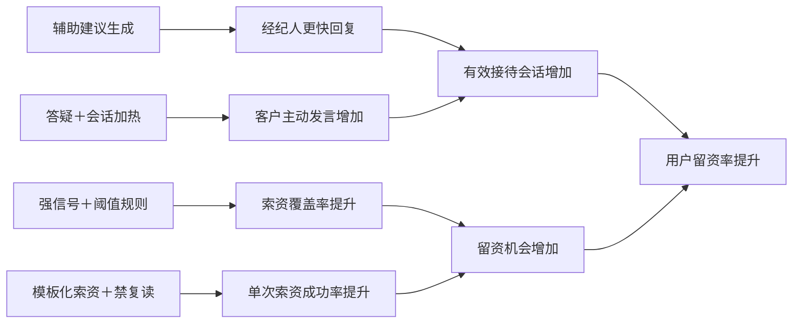
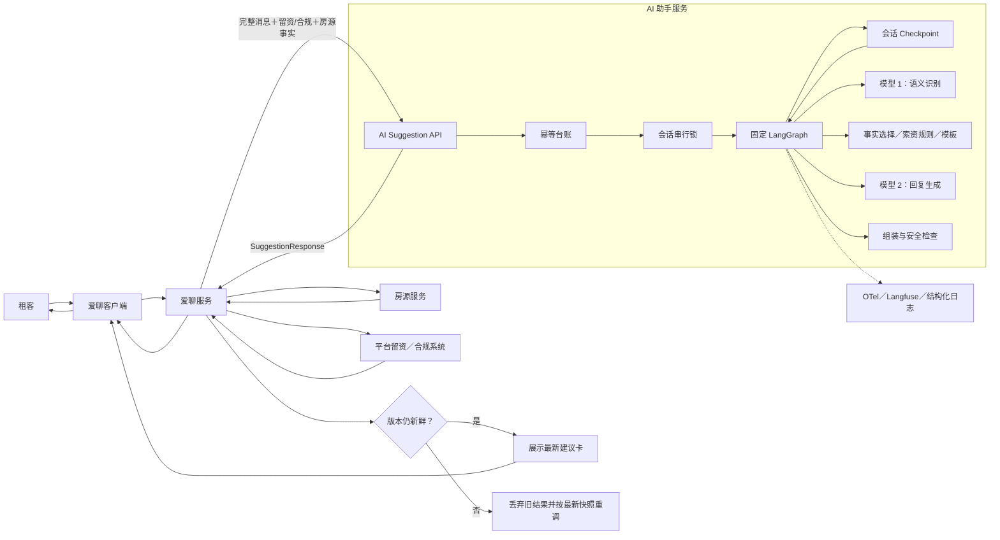
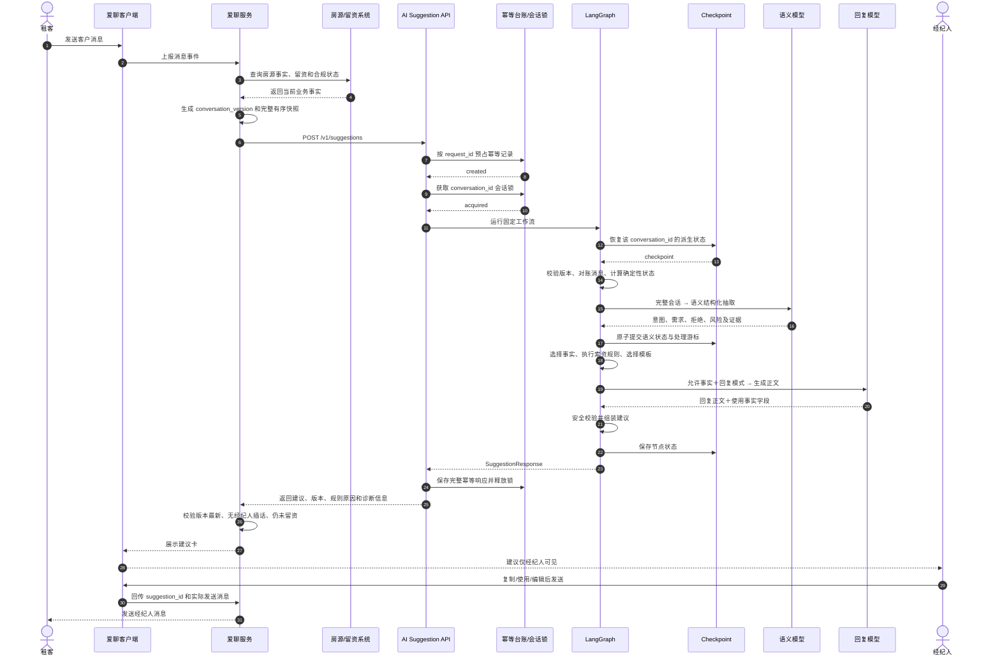
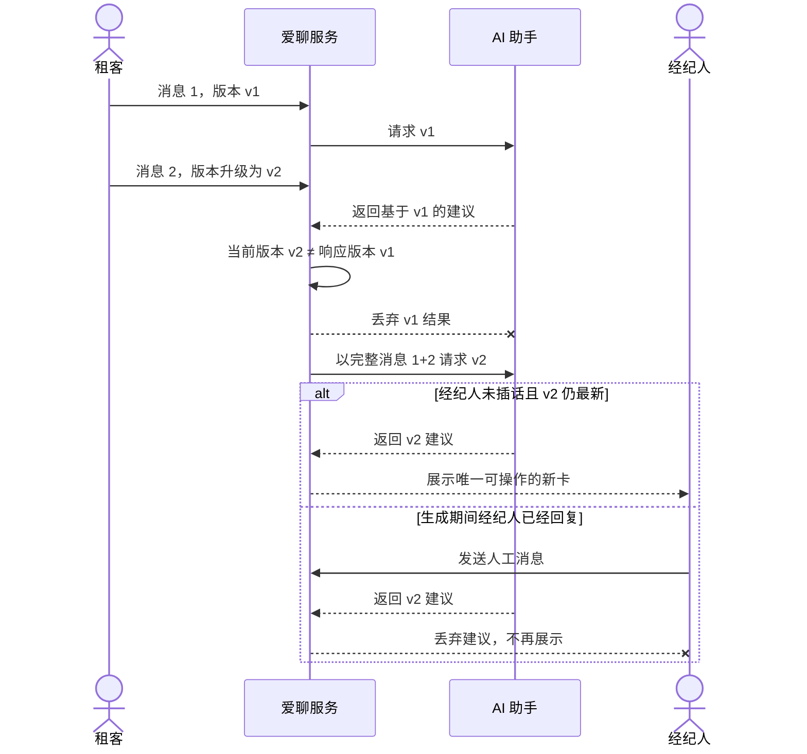
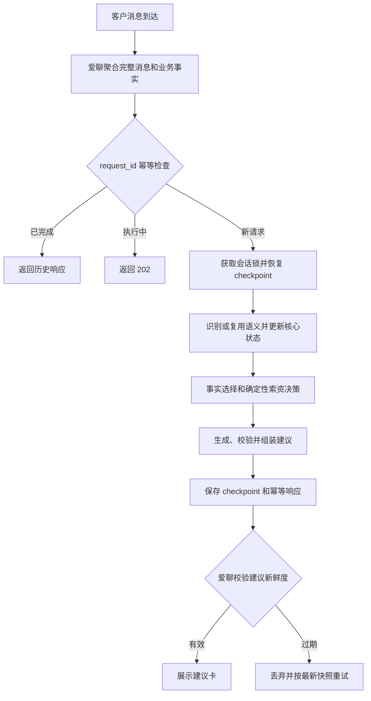
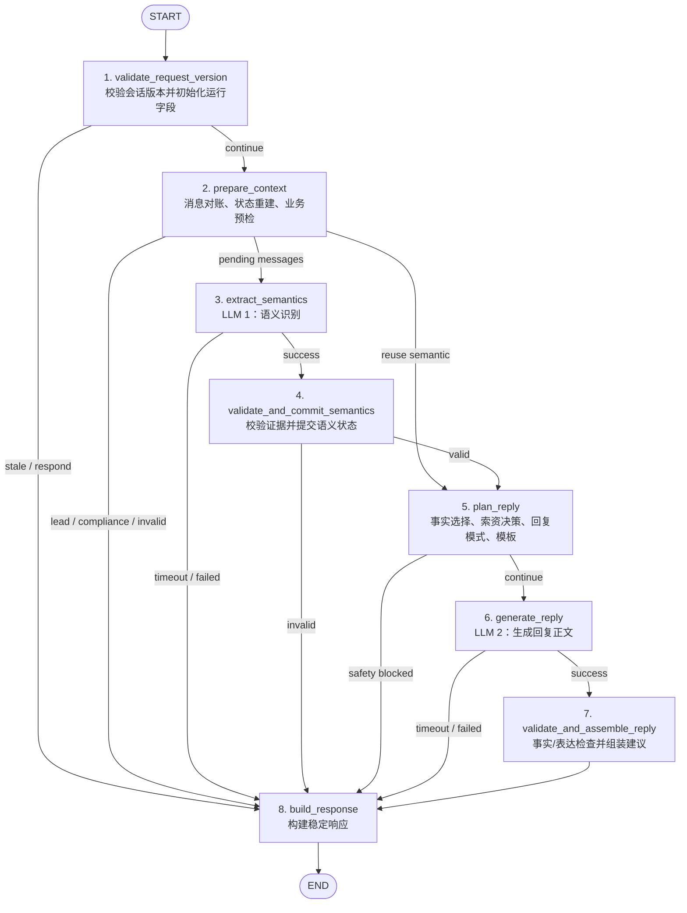
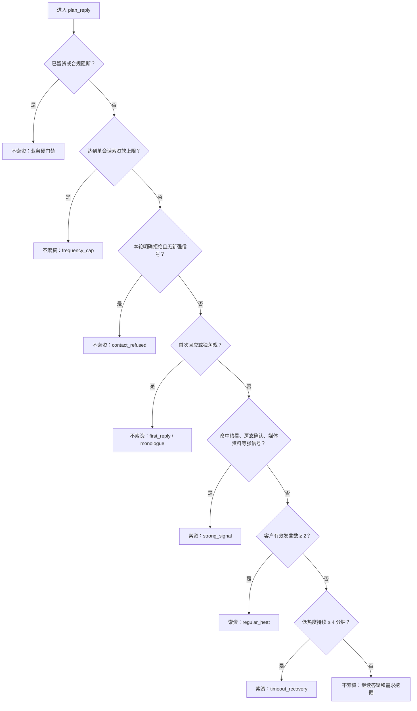
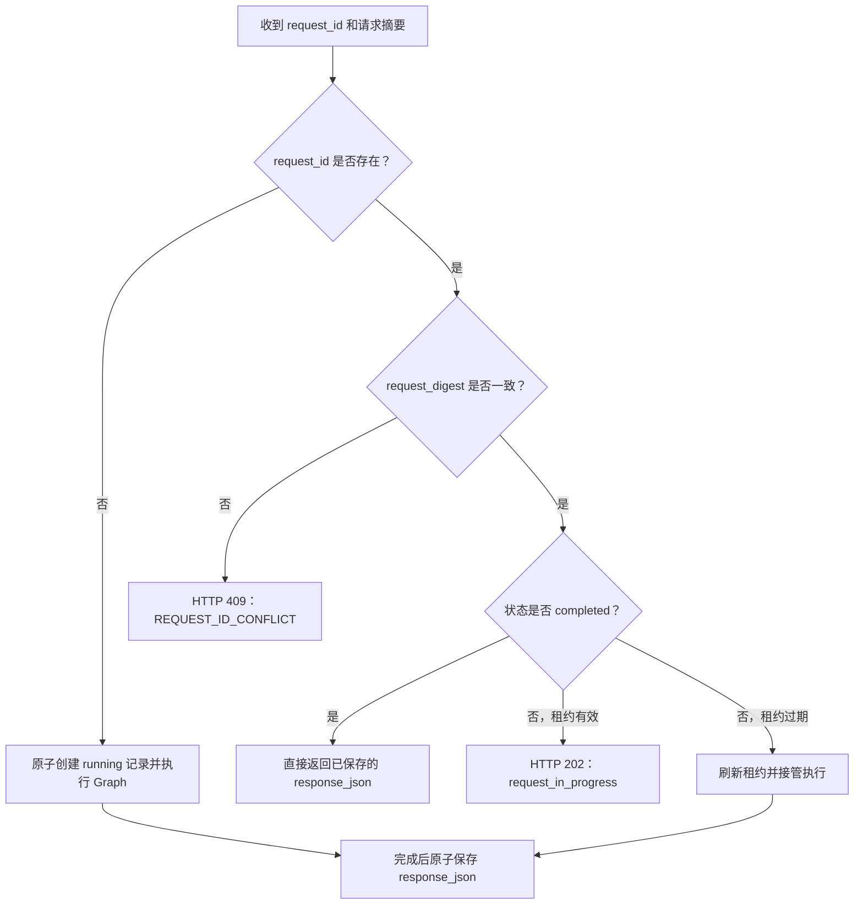
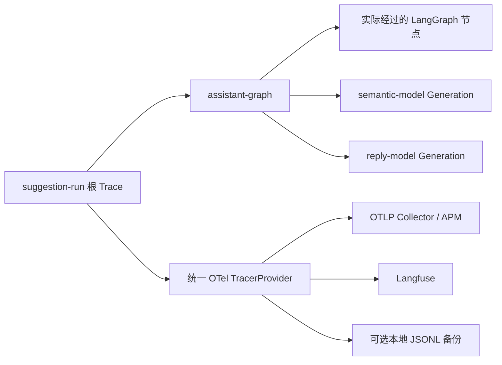
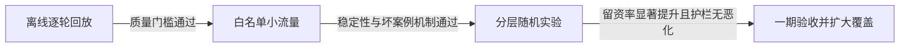

# 租房爱聊 AI 助手一期技术方案（评审版）

## 1. 需求背景

### 1.1 业务问题

租房爱聊的转化窗口短、客户问题集中、经纪人能力差异明显。数据分析表明，高低留资率经纪人的差异可归纳为四类可产品化策略：

1. 回复是否及时；
2. 什么时候索要联系方式；
3. 索资时使用什么话术；
4. 非索资轮次如何答疑和加热会话。

其中，房源信息咨询占客户问题的 54.4%，覆盖约 90% 的会话。因此，AI 助手不能只做索资，必须先提供可信的基础服务，再执行转化策略。

### 1.2 业务指标现状与目标

| 时间 | 用户留资率 |
|---|---:|
| 2025.06.22—2025.07.21 | 22.31% |
| 2025.12 | 19.49% |
| 2026.06.22—2026.07.21 | 19.43%，同比下降 12.92% |
| 2026.12 自然趋势预测 | 16.97% |
| **2026.12 产品目标** | **18.67%，较自然趋势相对提升 10%** |

留资率口径：

```text
用户留资率 = 产生留资的有效会话数 / 客户至少发送一条消息的有效会话数
```

### 1.3 对系统提出的四项要求

| 要求 | 技术含义 |
|---|---|
| 实时理解客户 | 每条客户消息都要结合完整上下文识别多意图、需求变化和拒绝留资 |
| 策略稳定执行 | 索资与否必须由确定性规则决定，不能由模型自由发挥 |
| 回答真实可信 | 房源事实必须来自爱聊服务传入的可信快照，缺失时明确核实 |
| 人机权限清晰 | 一期 AI 后端只返回建议，发送动作始终由经纪人在爱聊完成 |

---

## 2. 业务收益

### 2.1 收益拆解

| 收益方向 | 实现机制 | 预期结果 |
|---|---|---|
| 复制头部经验 | 将索资时机、索资话术和会话加热规则固化为统一工作流 | 降低经纪人能力差异，重点提升中尾部经纪人 |
| 提升索资覆盖 | 客户发言达到阈值或出现约看、在租确认等强信号时稳定触发 | 缩小当前 40.9% 会话从未索资的缺口 |
| 提升会话热度 | 非索资轮次通过答疑和单一反问引导客户继续表达 | 将客户主动发言中位数从 1 条推向 2—4 条 |
| 支撑持续优化 | 每条建议携带唯一 ID、规则原因、模板和版本信息 | 支持 A/B 实验、模板汰换、坏案例复盘 |

### 2.2 指标传导关系



### 2.3 一期验证指标

| 指标层级 | 核心指标 |
|---|---|
| 业务结果 | 实验组相对对照组的用户留资率提升 |
| 产品使用 | 建议覆盖率、采纳率、直接发送率、编辑后发送率、忽略率 |
| 策略过程 | 首次回复时长、索资覆盖率、单次索资成功率、主动发言条数、需求挖掘覆盖率 |
| 质量护栏 | 房源事实错误率、已留资后索资建议数、客户负反馈率、经纪人停用率 |

## 3. 核心设计原则

### 3.1 服务优先

先回答客户当前问题，再执行索资。索资轮次的最终结构固定为：

```text
可信回答正文 + 审核过的索资短句
```

### 3.2 决策与内容分离

- 「要不要索资」由规则决定；
- 「索资怎么说」由模板库决定；
- 「基础回答怎么自然表达」由模型决定。

模型不能改变索资结论，也不能在正文中绕过模板自行索资。

### 3.3 生成与发送解耦

AI 后端只负责生成建议，不管理建议卡、不等待经纪人操作，也不发送客户消息。爱聊服务负责检查建议是否仍基于最新消息，爱聊客户端负责展示建议并由经纪人确认发送。

### 3.4 事实与状态分层

- 消息、留资、合规、房源信息属于业务事实，每次由爱聊服务传入；
- 客户发言数、需求画像、索资历史等属于 AI 派生状态，由 AI 服务维护；
- 原始会话和房源值不写入 checkpoint。

### 3.5 默认安全失败

语义失败、回复失败、事实越界或模板耗尽时，不返回可能错误的建议；观测系统故障则 fail-open，不阻断业务主链。

---

## 4. 技术选型

| 技术 | 用途 | 选择理由 |
|---|---|---|
| Python 3.13 | 服务实现 | AI 生态成熟，适合结构化模型调用与规则编排 |
| FastAPI | HTTP API | 异步、高性能、自动 OpenAPI、与 Pydantic 原生集成 |
| Pydantic v2 | 输入输出 Schema | 严格校验请求、模型结构化输出和配置资产，减少隐式容错 |
| LangGraph 1.2 | 固定工作流与状态 | 支持显式节点、条件边、checkpoint 和按线程恢复 |
| HTTPX | 模型网关 | 异步调用，统一支持 Anthropic 与 OpenAI 兼容协议 |
| PostgreSQL | 生产状态和可靠性 | 同时承载 LangGraph checkpoint、幂等台账和 advisory lock |
| OpenTelemetry | 通用可观测性 | 统一 Trace 上下文，可对接现有 APM/Collector |
| Langfuse | 模型链路观测 | 记录 Graph 实际路径、模型 Generation、Prompt/模型版本和 token |
| structlog | 结构化日志 | 便于关联 `request_id`、`trace_id` 和脱敏后的业务元数据 |
| uv + Ruff + mypy + pytest | 工程质量 | 锁定依赖、格式/静态检查、严格类型和分层测试 |
| Docker | 部署 | 固化运行环境，便于测试和生产交付 |

### 4.1 为什么不采用开放式 Agent

本场景的业务步骤稳定、规则明确、安全约束强。固定 Graph 相比开放式 Agent 具备四项优势：

1. 模型无法绕过规则或自行调用未知工具；
2. 每次决策都能定位到具体节点和规则原因；
3. 时延、成本和失败分支可预算；
4. 便于回放、A/B 实验和问题复现。

### 4.2 为什么只保留两个模型节点

| 模型节点 | 输入 | 输出 | 明确不负责 |
|---|---|---|---|
| 语义识别 | 完整会话、触发消息、业务上下文 | 多意图、标准化语义、需求变化、拒绝证据、风险意图 | 不决定索资、不生成回复 |
| 回复生成 | 完整会话、语义结果、累计需求、允许事实、回复模式 | 回复正文、使用的事实字段、反问字段 | 不查询房源、不生成索资句 |

其余步骤全部使用确定性代码，保证规则稳定、成本可控、结果可解释。

---

## 5. 总体架构与系统职责

### 5.1 总体架构图



### 5.2 系统职责划分

| 系统/模块 | 负责 | 不负责 |
|---|---|---|
| 爱聊客户端 | 展示建议卡；复制、使用、忽略；展示留资卡片提示；发送经纪人确认后的消息 | 不执行 AI 决策，不计算索资规则 |
| 爱聊服务 | 聚合完整有序消息；查询房源事实；同步留资/合规；生成会话版本；发布前新鲜度检查；撤旧卡；事件回传 | 不维护 AI 内部语义状态，不生成回复 |
| 房源服务 | 提供房租、楼层、电梯、面积等真实字段及缺失/过期状态 | 不组织对客话术 |
| 留资/合规系统 | 提供留资、拒绝联系、存量合同、投诉等当前业务事实 | 不决定建议内容 |
| AI API/服务层 | 请求校验、幂等、会话串行、Graph 调用和稳定响应 | 不展示、不发送、不做离线归因 |
| LangGraph | 编排节点、条件路由和会话派生状态 | 不保存完整原始消息和房源值 |
| 模型网关 | 统一调用 Anthropic/OpenAI 兼容协议并返回结构化结果 | 不承载业务规则 |
| 配置资产 | 原子发布模型、Prompt、Graph/State 版本、规划规则和模板 | 不保存运行时会话数据 |
| 数据分析平台 | 离线计算建议采纳、索资成功、模板效果和实验结果 | 不进入在线关键链路 |

### 5.3 关键边界结论

1. AI 后端不直接调用房源服务；爱聊服务在调用 AI 前完成房源查询。
2. AI 服务返回的是建议，不是已发送消息。
3. `conversation_version` 的最终新鲜度判断必须由爱聊服务执行，因为生成期间是否出现新客户消息或经纪人插话，只有爱聊服务知道。
4. Langfuse/OTel 是观测系统，不是业务审计、幂等或归因事实源。

---

## 6. 系统交互时序图

### 6.1 正常生成与展示



### 6.2 客户连发或经纪人插话



---

## 7. 业务流程图

仅展示正常业务主链和幂等分支，节点级异常处理见 LangGraph 节点图。



---

## 8. LangGraph 节点实现

### 8.1 LangGraph 节点图



### 8.2 节点职责与输入输出

| # | 节点 | 类型 | 核心输入 | 核心输出 |
|---:|---|---|---|---|
| 1 | `validate_request_version` | 确定性 | 请求版本、已有 state schema/语义版本 | 是否旧请求、是否重建、单次运行字段 |
| 2 | `prepare_context` | 确定性 | 完整消息、留资/合规、历史 checkpoint | 客户发言数、人工回应、独角戏、索资历史、待处理消息 |
| 3 | `extract_semantics` | 模型 1 | 完整请求快照 | `SemanticExtraction` |
| 4 | `validate_and_commit_semantics` | 确定性 | 语义结果、客户消息 ID、旧需求画像 | 证据校验结果、需求合并、处理游标和摘要 |
| 5 | `plan_reply` | 确定性 | 语义、状态、房源事实、规划配置 | 允许事实、索资决策、回复模式、索资模板 |
| 6 | `generate_reply` | 模型 2 | 完整会话、语义、允许事实、回复模式 | `ReplyDraft` |
| 7 | `validate_and_assemble_reply` | 确定性 | 回复草稿、允许事实、索资决策、模板 | 最终 `Suggestion` 或 `safety_blocked` |
| 8 | `build_response` | 确定性 | 当前 Graph State | `SuggestionResponse`、诊断信息和版本集合 |

### 8.3 节点实现约束

- 每个节点只返回 State 增量，不原地修改共享状态。
- 模型节点没有外部业务副作用。
- 完整消息、房源事实和 Prompt 不作为 State 增量返回。
- 只有语义证据通过校验后，才推进语义处理游标。
- 回复正文出现索资关键词、越界事实字段或违规反问时，返回 `safety_blocked`。
- 每次实际执行路径通过 LangGraph Callback 进入统一 Trace。

---

## 9. AI 后端状态设计

### 9.1 状态边界

```text
thread_id = conversation_id
```

爱聊负责会话拆分，并在每次请求中提供完整消息、房源、留资和合规事实。AI 后端不按日期再次拆分会话，也不在 checkpoint 保存上述原始业务数据。

| 状态类型 | 保存位置 | 内容 |
|---|---|---|
| 核心会话状态 | LangGraph checkpoint | 语义处理进度、累计需求和最近语义结果 |
| Graph 运行快照 | LangGraph checkpoint | 本轮状态、规划结果、回复草稿和响应；下次请求开始时重置 |
| 请求幂等状态 | `suggestion_runs` | 请求摘要、执行状态、租约和完整响应 |
| 本次运行上下文 | 不持久化 | 完整业务输入、配置、模型客户端、密钥和计时器 |

### 9.2 核心状态定义

| 字段 | 含义 | 何时更新 |
|---|---|---|
| `state_schema_version` | Checkpoint 结构版本 | 请求开始时写入；不兼容时重建状态 |
| `assistant_state_version` | AI 派生状态版本 | 新语义通过校验后加 1 |
| `last_semantic_conversation_version` | 最近完成语义处理的会话版本 | 新语义提交时更新 |
| `last_semantic_message_sequence` | 最近处理到的消息序号 | 新语义提交时推进 |
| `processed_prefix_digest` | 已处理消息快照的 HMAC 摘要 | 新语义提交时重算，用于检测历史修改或撤回 |
| `requirements` | 已确认的客户需求集合 | 合并新需求；同名字段以新值覆盖 |
| `last_semantic_result` | 最近一次合法的结构化语义结果 | 新语义提交时覆盖；同版本无新增消息时复用 |

以上 7 个字段是跨请求延续的核心会话状态。`AssistantGraphState` 中的运行状态、规划结果、草稿、建议、响应和耗时字段仅用于 LangGraph 节点传值与故障恢复，不作为长期业务记忆。

### 9.3 状态更新规则

1. 低于 `last_semantic_conversation_version` 的请求返回 `stale_request`，不推进核心状态。
2. 状态 Schema 变化或消息摘要不一致时，基于爱聊完整快照重建状态。
3. 有新增客户消息时执行语义识别；只有语义输出结构和证据消息校验通过后，才更新版本、游标、摘要、需求和语义结果。
4. 同一会话版本没有新增消息时，复用 `last_semantic_result`。
5. 客户发言数、人工回应、独角戏、实际索资历史和已用模板均从完整消息重算，不写入核心状态。

---

## 10. 索资决策与回复组装

### 10.1 索资决策顺序



### 10.2 回复模式

| 条件 | `reply_mode` | 生成要求 |
|---|---|---|
| 所需房源字段缺失/过期/不支持 | `verify` | 只表达需要核实，不猜测 |
| 本轮索资 | `answer_only` | 只生成回答正文，不反问 |
| 本轮不索资 | `answer_and_question` | 可在回答后追加一个必要问题 |

### 10.3 回复组装与安全规则

1. 回复模型只接收按意图筛选后的 `available` 房源字段；
2. 模型返回的 `used_fact_keys` 必须是允许字段的子集；
3. 房租、面积、楼层等数字只能来自允许事实或客户原话；
4. 房源事实缺失、过期或不支持时进入核实模式，不允许猜测；
5. 回复正文不得包含电话、微信、联系方式等索资表达；
6. 首次回复和索资轮次不得反问；非索资轮次最多包含一个必要问题；
7. 第 2—4 回合至少完成一次需求挖掘，且不得重复询问已确认需求；
8. 投诉、存量合同、议价等风险意图使用固定安全话术；
9. 回复正文设置 40 字硬限制，超限最多重生成一次，仍超限则安全截断；
10. 索资短句只能来自已审核的版本化模板，被拒后更换模板和索资理由；
11. 最终顺序固定为「回答正文在前，索资短句在后」；
12. 索资时返回 `attach_contact_card=true`；
13. `suggestion_id` 由 `request_id` 确定性生成。

---

## 11. 可靠性、一致性与可观测性

### 11.1 请求幂等

最小幂等流程：



| 场景 | 行为 |
|---|---|
| 相同 `request_id`、相同请求、已完成 | 返回数据库中保存的完整响应，不重复调用模型 |
| 相同 `request_id`、相同请求、执行中 | HTTP 202，状态为 `request_in_progress`，建议 1 秒后重试 |
| 相同 `request_id`、不同请求体 | HTTP 409，拒绝请求 ID 复用 |
| 执行器异常退出 | 租约过期后允许新执行器接管 |

请求摘要使用服务端 HMAC，生产幂等台账通过 lease token 防止旧执行器覆盖新结果。除首次创建和租约过期接管外，幂等判断不会触发会话锁、checkpoint 恢复或模型调用。

### 11.2 单会话串行

- 开发环境：进程内会话锁；
- 生产环境：PostgreSQL advisory lock；
- 锁键：`conversation_id`；
- 同一会话只允许一个 Graph 运行，不同会话可以并行。

该机制保证 checkpoint 更新顺序，但不能替代爱聊服务的发布前新鲜度检查。

### 11.3 状态一致性

1. `conversation_version` 防止旧快照覆盖新状态；
2. `message_sequence` 保证完整消息有序；
3. 历史消息 HMAC 摘要检测修改或撤回；
4. schema 版本变化或摘要不一致时触发状态重建；
5. 原始消息和房源事实不写入 checkpoint，降低敏感信息持久化风险。

### 11.4 配置和版本

配置包原子引用：

- `config_bundle_id`；
- `graph_version`；
- `state_schema_version`；
- 语义 Prompt 版本；
- 回复 Prompt 版本；
- 回复规划版本；
- 语义/回复模型 Profile。

应用启动时完整加载并校验，缺少资产、版本不匹配或模型凭据缺失时启动失败，不使用隐式 Mock 或默认规则降级。

一期版本基线为 `assistant_graph_v2`、`assistant_state_v3`、`cb_assistant_minimax_v4`、`semantic_v1`、`reply_v3` 和 `reply_planning_v1`。配置包升级必须通过新版本发布，运行中的单次请求不得混用不同版本资产。

### 11.5 可观测性



观测原则：

- OTel 和 Langfuse 共用 Trace 上下文；
- 模型 Generation 记录模型参数、Prompt 版本、耗时、结构化输出状态和 token；
- 默认不采集消息正文、完整 Prompt、房源值和联系方式；
- 任一观测出口失败均 fail-open，不影响建议生成；
- 静态 Graph 可通过 `/internal/graph/mermaid` 和 `/internal/graph/png` 查看。

---

## 12. 验收标准

### 12.1 技术与质量门槛

| 指标 | 建议门槛 |
|---|---:|
| 强信号 Recall | ≥ 95% |
| 强信号 Precision | ≥ 90% |
| 明确拒绝 Recall | ≥ 95% |
| 确定性规则用例通过率 | 100% |
| 模型结构化输出成功率 | ≥ 99.5% |
| 房源事实错误率 | 0 |
| 已留资后索资建议数 | 0 |
| 相同索资话术重复率 | 0 |
| 建议生成成功率 | ≥ 98% |
| 端到端 P95 | ≤ 5 秒 |

### 12.2 业务验收路径



### 12.3 上线红线

以下任一项发生，应阻断放量或立即熔断：

1. 建议编造房租、楼层、面积、房态等房源事实；
2. 已留资客户仍收到索资建议；
3. 投诉、存量合同等风险场景输出不当承诺；
4. 同一会话重复使用相同索资话术；
5. 爱聊服务无法可靠识别并丢弃过期建议；
6. `suggestion_id` 无法贯穿展示、发送和留资归因链路。

---

## 13. 方案结论

本方案以爱聊提供的完整业务事实为输入，以固定 LangGraph 编排一期建议生成流程，通过两个结构化模型节点分别完成语义理解和自然表达，并由确定性规则控制索资、事实与安全边界。

AI 后端仅维护 `conversation_id` 维度的最小会话派生状态、Graph 执行快照和请求幂等状态；所有可由完整消息快照重建的业务事实均不重复持久化。爱聊负责会话边界、业务事实聚合、建议新鲜度判断和最终发送，确保系统职责清晰、状态可恢复、规则可解释、事实可追溯、效果可验证。
