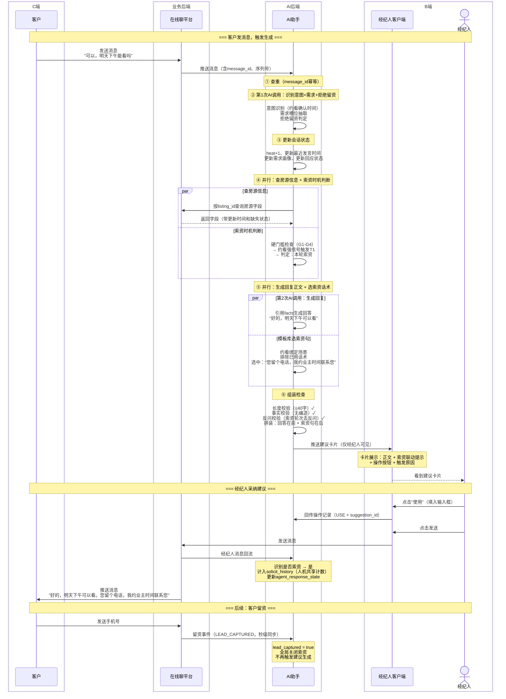
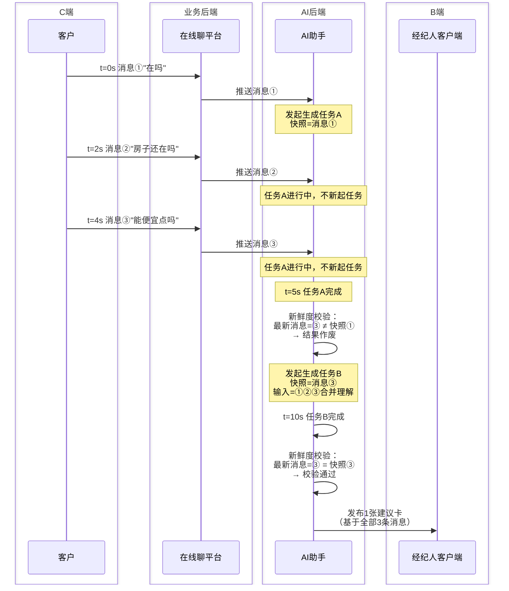
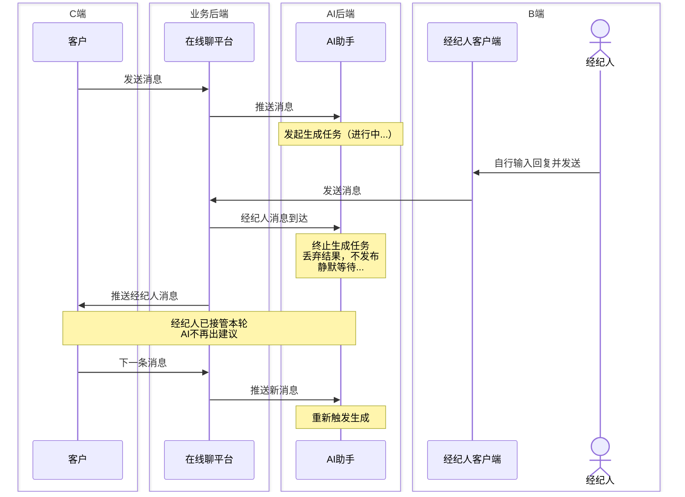
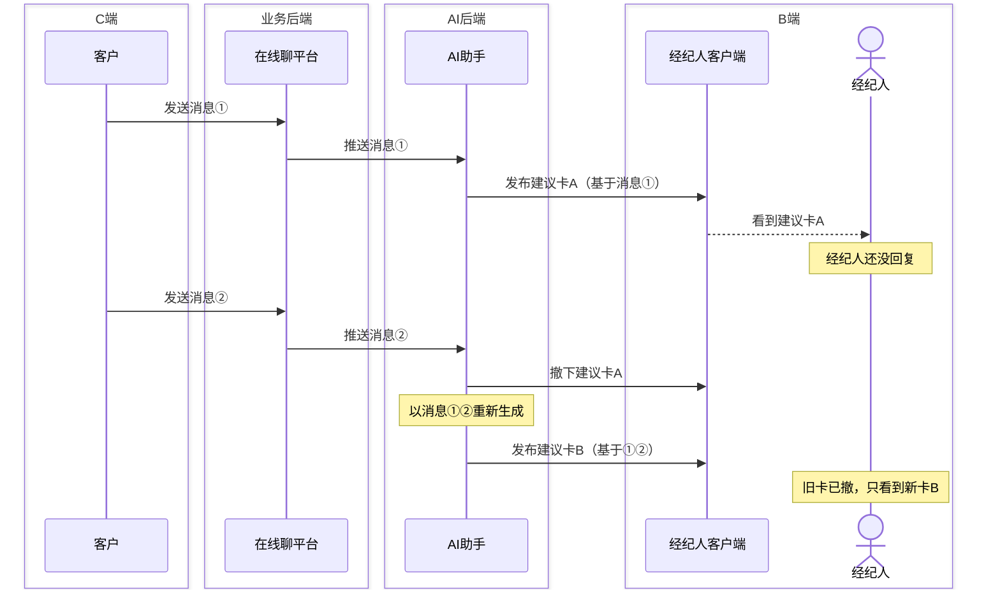
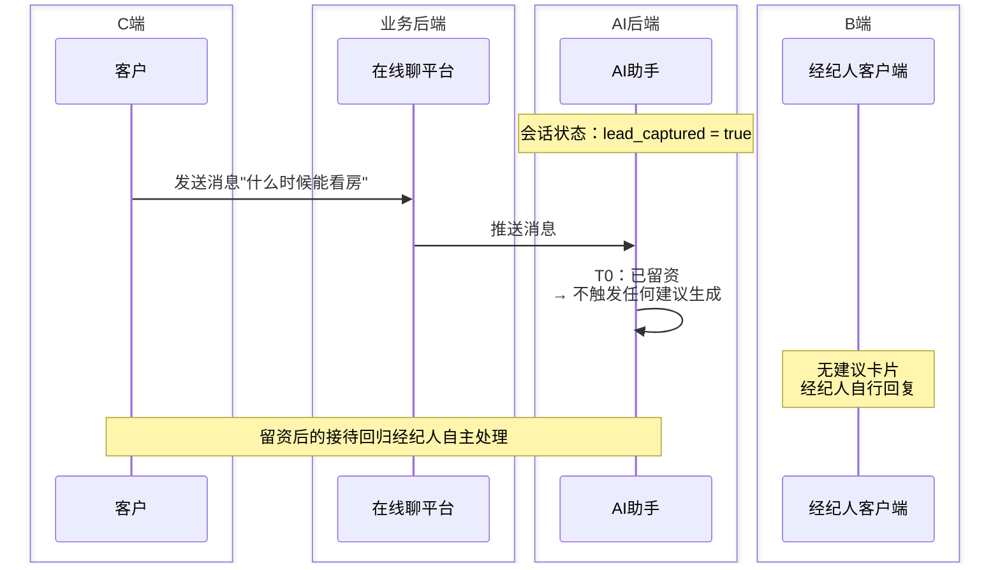
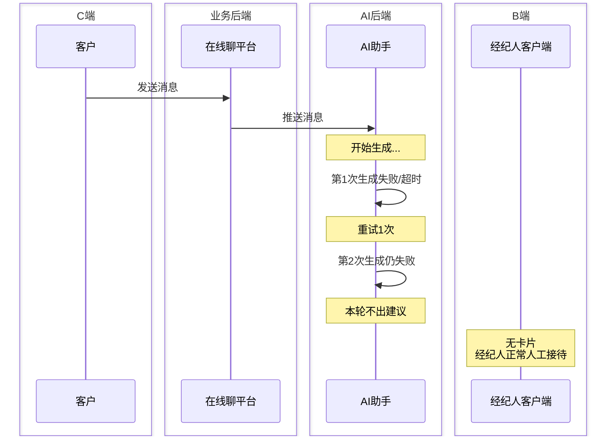

# 租房在线聊AI助手 - 完整时序图

## 主流程：客户消息 → AI生成建议 → 经纪人发送

```mermaid
sequenceDiagram
    box C端
        participant 客户
    end
    box 业务后端
        participant 在线聊平台
    end
    box AI后端
        participant AI助手
    end
    box B端
        participant 经纪人客户端
        actor 经纪人
    end

    Note over 客户,经纪人: === 客户发消息，触发生成 ===

    客户->>在线聊平台: 发送消息<br/>"可以，明天下午能看吗"
    在线聊平台->>AI助手: 推送消息（含message_id、序列号）

    Note over AI助手: ① 查重（message_id幂等）

    Note over AI助手: ② 第1次AI调用：识别意图+需求+拒绝留资
    AI助手->>AI助手: 意图识别（约看确认时间）<br/>需求槽位抽取<br/>拒绝留资判定

    Note over AI助手: ③ 更新会话状态
    AI助手->>AI助手: heat+1、更新最近发言时间<br/>更新需求画像、更新回应状态

    Note over AI助手: ④ 并行：查房源信息 + 索资时机判断
    par 查房源信息
        AI助手->>在线聊平台: 按listing_id查询房源字段
        在线聊平台-->>AI助手: 返回字段（带更新时间和缺失状态）
    and 索资时机判断
        AI助手->>AI助手: 硬门槛检查（G1-G4）<br/>→ 约看强信号触发T1<br/>→ 判定：本轮索资
    end

    Note over AI助手: ⑤ 并行：生成回复正文 + 选索资话术
    par 第2次AI调用：生成回复
        AI助手->>AI助手: 引用facts生成回答<br/>“好的，明天下午可以看”
    and 模板库选索资句
        AI助手->>AI助手: 约看绑定场景<br/>排除已用话术<br/>选中：“您留个电话，我约业主时间联系您”
    end

    Note over AI助手: ⑥ 组装检查
    AI助手->>AI助手: 长度校验（≤40字）✓<br/>事实校验（无编造）✓<br/>反问校验（索资轮次去反问）✓<br/>拼装：回答在前 + 索资句在后

    AI助手->>经纪人客户端: 推送建议卡片（仅经纪人可见）
    Note over 经纪人客户端: 卡片展示：正文 + 索资联动提示<br/>+ 操作按钮 + 触发原因

    经纪人客户端-->>经纪人: 看到建议卡片

    Note over 客户,经纪人: === 经纪人采纳建议 ===

    经纪人->>经纪人客户端: 点击"使用"（填入输入框）
    经纪人客户端->>AI助手: 回传操作记录（USE + suggestion_id）
    经纪人->>经纪人客户端: 点击发送
    经纪人客户端->>在线聊平台: 发送消息

    在线聊平台->>AI助手: 经纪人消息回流
    Note over AI助手: 识别是否索资 → 是<br/>计入solicit_history（人机共享计数）<br/>更新agent_response_state

    在线聊平台->>客户: 推送消息<br/>"好的，明天下午可以看。您留个电话，我约业主时间联系您"

    Note over 客户,经纪人: === 后续：客户留资 ===

    客户->>在线聊平台: 发送手机号
    在线聊平台->>AI助手: 留资事件（LEAD_CAPTURED，秒级同步）
    Note over AI助手: lead_captured = true<br/>全局关闭索资<br/>不再触发建议生成
```

## 分支场景1：客户连发多条消息

```mermaid
sequenceDiagram
    box C端
        participant 客户
    end
    box 业务后端
        participant 在线聊平台
    end
    box AI后端
        participant AI助手
    end
    box B端
        participant 经纪人客户端
    end

    客户->>在线聊平台: t=0s 消息①"在吗"
    在线聊平台->>AI助手: 推送消息①
    Note over AI助手: 发起生成任务A<br/>快照=消息①

    客户->>在线聊平台: t=2s 消息②"房子还在吗"
    在线聊平台->>AI助手: 推送消息②
    Note over AI助手: 任务A进行中，不新起任务

    客户->>在线聊平台: t=4s 消息③"能便宜点吗"
    在线聊平台->>AI助手: 推送消息③
    Note over AI助手: 任务A进行中，不新起任务

    Note over AI助手: t=5s 任务A完成

    AI助手->>AI助手: 新鲜度校验：<br/>最新消息=③ ≠ 快照①<br/>→ 结果作废

    Note over AI助手: 发起生成任务B<br/>快照=消息③<br/>输入=①②③合并理解

    AI助手->>AI助手: t=10s 任务B完成

    AI助手->>AI助手: 新鲜度校验：<br/>最新消息=③ = 快照③<br/>→ 校验通过

    AI助手->>经纪人客户端: 发布1张建议卡<br/>（基于全部3条消息）
```

## 分支场景2：经纪人抢答

```mermaid
sequenceDiagram
    box C端
        participant 客户
    end
    box 业务后端
        participant 在线聊平台
    end
    box AI后端
        participant AI助手
    end
    box B端
        participant 经纪人客户端
        actor 经纪人
    end

    客户->>在线聊平台: 发送消息
    在线聊平台->>AI助手: 推送消息
    Note over AI助手: 发起生成任务（进行中...）

    经纪人->>经纪人客户端: 自行输入回复并发送
    经纪人客户端->>在线聊平台: 发送消息

    在线聊平台->>AI助手: 经纪人消息到达
    Note over AI助手: 终止生成任务<br/>丢弃结果，不发布<br/>静默等待...

    在线聊平台->>客户: 推送经纪人消息

    Note over 客户,AI助手: 经纪人已接管本轮<br/>AI不再出建议

    客户->>在线聊平台: 下一条消息
    在线聊平台->>AI助手: 推送新消息
    Note over AI助手: 重新触发生成
```

## 分支场景3：建议展示后客户新消息

```mermaid
sequenceDiagram
    box C端
        participant 客户
    end
    box 业务后端
        participant 在线聊平台
    end
    box AI后端
        participant AI助手
    end
    box B端
        participant 经纪人客户端
        actor 经纪人
    end

    客户->>在线聊平台: 发送消息①
    在线聊平台->>AI助手: 推送消息①
    AI助手->>经纪人客户端: 发布建议卡A（基于消息①）
    经纪人客户端-->>经纪人: 看到建议卡A

    Note over 经纪人: 经纪人还没回复

    客户->>在线聊平台: 发送消息②
    在线聊平台->>AI助手: 推送消息②

    AI助手->>经纪人客户端: 撤下建议卡A

    Note over AI助手: 以消息①②重新生成
    AI助手->>经纪人客户端: 发布建议卡B（基于①②）

    Note over 经纪人: 旧卡已撤，只看到新卡B
```

## 分支场景4：已留资会话

```mermaid
sequenceDiagram
    box C端
        participant 客户
    end
    box 业务后端
        participant 在线聊平台
    end
    box AI后端
        participant AI助手
    end
    box B端
        participant 经纪人客户端
    end

    Note over AI助手: 会话状态：lead_captured = true

    客户->>在线聊平台: 发送消息"什么时候能看房"
    在线聊平台->>AI助手: 推送消息

    AI助手->>AI助手: T0：已留资<br/>→ 不触发任何建议生成

    Note over 经纪人客户端: 无建议卡片<br/>经纪人自行回复

    Note over 客户,AI助手: 留资后的接待回归经纪人自主处理
```

## 异常场景：生成失败

```mermaid
sequenceDiagram
    box C端
        participant 客户
    end
    box 业务后端
        participant 在线聊平台
    end
    box AI后端
        participant AI助手
    end
    box B端
        participant 经纪人客户端
    end

    客户->>在线聊平台: 发送消息
    在线聊平台->>AI助手: 推送消息

    Note over AI助手: 开始生成...

    AI助手->>AI助手: 第1次生成失败/超时
    Note over AI助手: 重试1次

    AI助手->>AI助手: 第2次生成仍失败
    Note over AI助手: 本轮不出建议

    Note over 经纪人客户端: 无卡片<br/>经纪人正常人工接待
```